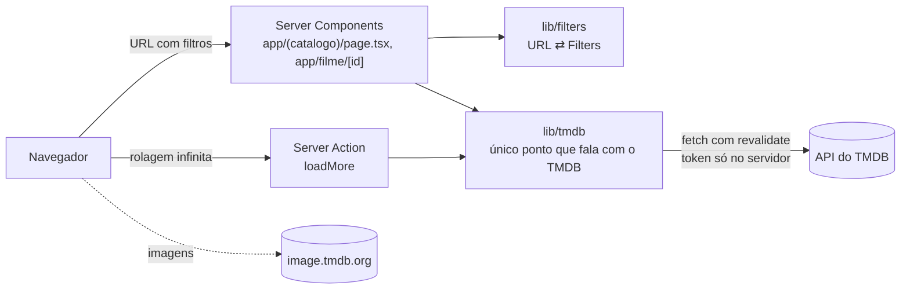

# 🎬 EmCartaz

Catálogo dos filmes disponíveis **agora** nos serviços de streaming por assinatura no **Brasil**, com dados do [TMDB](https://www.themoviedb.org) e disponibilidade da JustWatch.

**Demo:** https://catalogo-filmes-azure.vercel.app


## Funcionalidades

- Grade de pôsteres com rolagem infinita
- Filtro por plataforma (Netflix, Prime Video, HBO Max, Disney+, Globoplay, Apple TV, Paramount+, MUBI), gênero e ano, com ordenação por popularidade, nota ou lançamento
- Busca por título, limitada ao que está em streaming
- Página do filme com sinopse, elenco, trailer e "onde assistir"
- Todo o estado fica na URL: dá para compartilhar um link como `/?p=8&g=27&ordem=nota`

## Stack

Next.js 15 (App Router, Server Components, Server Actions) · TypeScript strict · Tailwind CSS v4 · zod · Vitest + Testing Library + MSW · Playwright · GitHub Actions · Vercel

## Arquitetura



- **`lib/tmdb` é a única fronteira com o TMDB.** Ela devolve tipos de domínio (`Movie`, `MovieDetails`…), e a UI nunca vê o formato cru da API.
- **`lib/filters` é a única fonte da verdade da URL.** A página lê a URL e os filtros escrevem nela.
- **Cache:** provedores e gêneros por 24h, listagens por 6h, detalhes por 24h.

## Decisões

| Decisão                                           | Por quê                                                                                                                                                |
| ------------------------------------------------- | ------------------------------------------------------------------------------------------------------------------------------------------------------ |
| Só Brasil e só assinatura (`flatrate`)            | Responde a "o que dá para assistir agora com o que eu assino"                                                                                          |
| Sem banco de dados                                | O discover do TMDB já filtra por plataforma, região e tipo; um índice próprio seria complexidade que o MVP ainda não pede                              |
| Limite de 500 páginas                             | É o teto do TMDB (10 mil filmes por combinação de filtros); ninguém rola tanto, e os filtros resolvem                                                  |
| Busca custa N+1 chamadas                          | O `/search` do TMDB não filtra por streaming, então cada um dos 20 resultados tem os provedores consultados em paralelo, com cache de 24h              |
| Allowlist de plataformas                          | A lista de provedores do TMDB mistura lojas de aluguel (Google Play, Apple TV); a faixa mostra só serviços de assinatura                               |
| Server Action recebe a query string               | É um endpoint público, então a entrada passa pelo mesmo parse/validação da URL                                                                         |
| Cada lista de filtros na URL tem no máximo 20 IDs | Limita o custo de uma requisição; a Server Action pública não tem rate limiting, e o cache do TMDB mitiga abusos                                       |
| `images.unoptimized: true`                        | As imagens vêm direto da CDN do TMDB, que já serve larguras pré-dimensionadas; evita consumir a cota de otimização de imagens do plano Hobby da Vercel |

## Rodando localmente

Requer Node 24 (`nvm use`) e um [token de leitura do TMDB](https://www.themoviedb.org/settings/api).

```bash
cp .env.example .env.local   # preencha TMDB_READ_TOKEN
npm install
npm run dev                  # http://localhost:3000
```

| Comando                              | O que faz                                                     |
| ------------------------------------ | ------------------------------------------------------------- |
| `npm test`                           | testes unitários e de integração (MSW, sem acesso à API real) |
| `npm run test:e2e`                   | Playwright contra um mock HTTP do TMDB                        |
| `npm run lint` / `npm run typecheck` | qualidade                                                     |

---


Este produto usa a API do TMDB mas não é endossado ou certificado pelo TMDB. Dados de streaming fornecidos por JustWatch.
