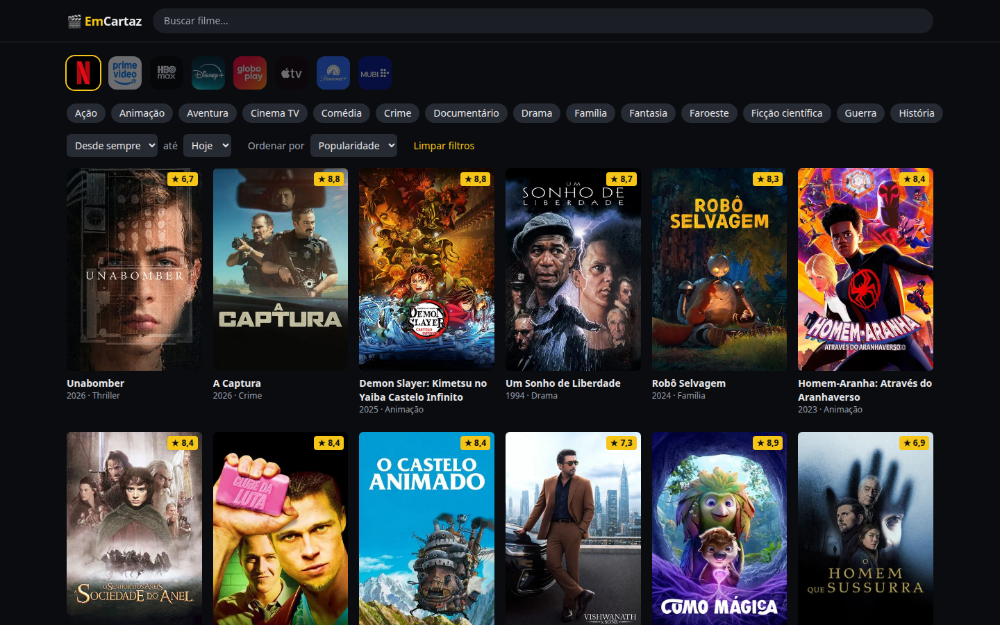
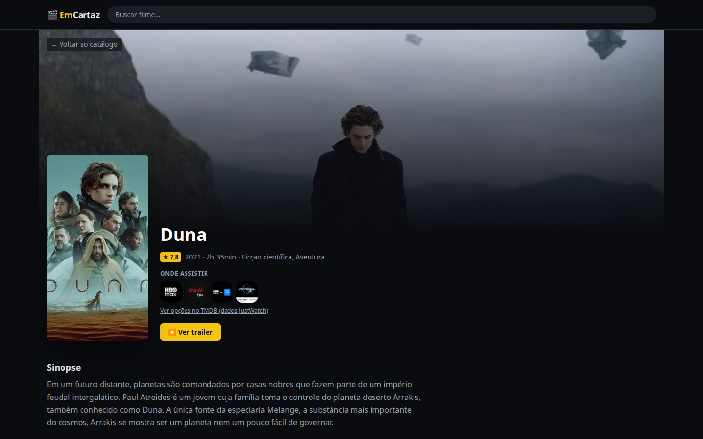
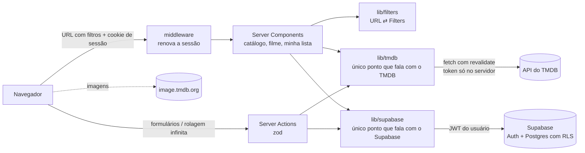

# 🎬 EmCartaz

Catálogo dos filmes disponíveis **agora** nos serviços de streaming por assinatura no **Brasil**, com dados do [TMDB](https://www.themoviedb.org) e disponibilidade da JustWatch.

**Demo:** https://catalogo-filmes-azure.vercel.app




## Funcionalidades

- Grade de pôsteres com rolagem infinita
- Filtro por plataforma (Netflix, Prime Video, HBO Max, Disney+, Globoplay, Apple TV, Paramount+, MUBI), gênero e ano, com ordenação por popularidade, nota ou lançamento
- Busca por título, limitada ao que está em streaming
- Página do filme com sinopse, elenco, trailer e "onde assistir"
- Todo o estado fica na URL: dá para compartilhar um link como `/?p=8&g=27&ordem=nota`
- Conta com e-mail e senha (com recuperação de senha por e-mail)
- **Minha lista**: salve filmes para assistir depois
- **Minhas plataformas**: marque o que você assina e o catálogo já abre filtrado

## Stack

Next.js 15 (App Router, Server Components, Server Actions) · TypeScript strict · Tailwind CSS v4 · zod · Supabase (Postgres + Auth, RLS) · Vitest + Testing Library + MSW · pgTAP · Playwright · GitHub Actions · Vercel

## Arquitetura



- **`lib/tmdb` é a única fronteira com o TMDB.** Ela devolve tipos de domínio (`Movie`, `MovieDetails`…), e a UI nunca vê o formato cru da API.
- **`lib/filters` é a única fonte da verdade da URL.** A página lê a URL e os filtros escrevem nela.
- **`lib/supabase` é a única fronteira com o Supabase.** Só o servidor fala com ele, com a chave pública e o JWT do usuário. Quem garante que cada um só vê os próprios dados é o **Row Level Security** do Postgres, provado por testes pgTAP em `supabase/tests`.
- **Cache:** provedores e gêneros por 24h, listagens por 6h, detalhes por 24h.

## Decisões

| Decisão                                           | Por quê                                                                                                                                                |
| ------------------------------------------------- | ------------------------------------------------------------------------------------------------------------------------------------------------------ |
| Só Brasil e só assinatura (`flatrate`)            | Responde a "o que dá para assistir agora com o que eu assino"                                                                                          |
| Supabase só para dados de usuário                 | Contas, lista e plataformas precisam de estado persistente; o catálogo continua vindo do TMDB, sem índice próprio                                      |
| Acesso ao Supabase só no servidor, com RLS        | Uma fronteira só (`lib/supabase`) e segurança em duas camadas: validação nas Server Actions e RLS no banco                                             |
| A lista guarda só o ID do TMDB                    | Detalhes vêm do TMDB com cache de 24h; nada duplicado para ficar desatualizado. Limite de 100 filmes segura o custo da página                          |
| `p=todas` na URL                                  | Com plataformas salvas, `/` abre filtrado; "todas" precisa ser explícito para o estado continuar na URL                                                |
| Sem confirmação de e-mail                         | Menos atrito para testar a demo; dá para ligar no painel do Supabase sem mudar código                                                                  |
| Páginas dinâmicas                                 | O header lê a sessão; as respostas do TMDB continuam no cache de `fetch`                                                                               |
| Limite de 500 páginas                             | É o teto do TMDB (10 mil filmes por combinação de filtros); ninguém rola tanto, e os filtros resolvem                                                  |
| Busca custa N+1 chamadas                          | O `/search` do TMDB não filtra por streaming, então cada um dos 20 resultados tem os provedores consultados em paralelo, com cache de 24h              |
| Allowlist de plataformas                          | A lista de provedores do TMDB mistura lojas de aluguel (Google Play, Apple TV); a faixa mostra só serviços de assinatura                               |
| Server Action recebe a query string               | É um endpoint público, então a entrada passa pelo mesmo parse/validação da URL                                                                         |
| Cada lista de filtros na URL tem no máximo 20 IDs | Limita o custo de uma requisição; a Server Action pública não tem rate limiting, e o cache do TMDB mitiga abusos                                       |
| `images.unoptimized: true`                        | As imagens vêm direto da CDN do TMDB, que já serve larguras pré-dimensionadas; evita consumir a cota de otimização de imagens do plano Hobby da Vercel |

## Rodando localmente

Requer Node 24 (`nvm use`), [Docker](https://docs.docker.com/engine/install/) e um [token de leitura do TMDB](https://www.themoviedb.org/settings/api).

```bash
npm install
npm run db:start             # Supabase local (Postgres, Auth e Mailpit em http://127.0.0.1:54324)
cp .env.example .env.local   # preencha TMDB_READ_TOKEN e as chaves de `npx supabase status`
npm run dev                  # http://localhost:3000
```

| Comando                              | O que faz                                                       |
| ------------------------------------ | --------------------------------------------------------------- |
| `npm test`                           | testes unitários e de integração (MSW, sem acesso a APIs reais) |
| `npm run db:test`                    | testes pgTAP de RLS e limites (com o Supabase local rodando)    |
| `npm run db:types`                   | regenera os tipos do banco depois de uma migration              |
| `npm run test:e2e`                   | Playwright contra o Supabase local e um mock HTTP do TMDB       |
| `npm run lint` / `npm run typecheck` | qualidade                                                       |

## Deploy do Supabase

1. `npx supabase link --project-ref <ref>` e `npx supabase db push`
2. Authentication → Providers → Email: desligar "Confirm email" e definir senha mínima de 8 caracteres
3. Authentication → URL Configuration: Site URL = domínio da Vercel; Redirect URLs com o domínio da Vercel e `http://localhost:3000/**`
4. Template de e-mail: nada a fazer. O e-mail padrão de redefinição do Supabase já funciona (fluxo PKCE: `/auth/confirmar?code=…`, aberto no mesmo navegador que pediu a recuperação). O template próprio em `supabase/templates/recovery.html` (`token_hash`) só é usado no ambiente local e no CI, porque editar templates no Supabase hospedado exige SMTP próprio
5. Vercel: definir `NEXT_PUBLIC_SUPABASE_URL` e `NEXT_PUBLIC_SUPABASE_PUBLISHABLE_KEY`

---


Este produto usa a API do TMDB mas não é endossado ou certificado pelo TMDB. Dados de streaming fornecidos por JustWatch.
