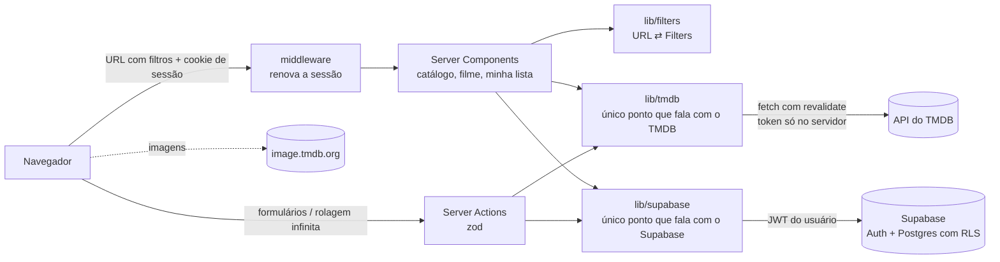

# Contas de usuário com Supabase — Plano de implementação

> **For agentic workers:** REQUIRED SUB-SKILL: Use superpowers:subagent-driven-development (recommended) or superpowers:executing-plans to implement this plan task-by-task. Steps use checkbox (`- [ ]`) syntax for tracking.

**Goal:** Adicionar contas (e-mail + senha), **Minha lista** e **Minhas plataformas** ao EmCartaz usando Supabase (Postgres + Auth), sem mudar a experiência de quem não está logado.

**Architecture:** O Next.js continua sendo o único servidor. `src/lib/supabase/` é a única fronteira com o Supabase (como `src/lib/tmdb/` é com o TMDB): client de servidor via `@supabase/ssr` com cookies, funções de domínio e nada de query na UI. Leituras em Server Components, escritas em Server Actions validadas com zod, e o banco se protege sozinho com RLS. O middleware renova a sessão.

**Tech Stack:** Next.js 15.5 (App Router) · TypeScript strict · `@supabase/supabase-js` + `@supabase/ssr` · Supabase CLI (npm `supabase`) + Docker · Postgres/pgTAP · zod 4 · Vitest + Testing Library · Playwright · GitHub Actions

**Spec:** [docs/superpowers/specs/2026-09-30-backend-supabase-design.md](../specs/2026-09-30-backend-supabase-design.md)

## Global Constraints

- Node 24 (`.nvmrc`), Next 15.5 (`middleware.ts`, não `proxy.ts`), zod 4, TypeScript strict.
- Todo texto visível ao usuário em pt-BR.
- Só a chave pública (`NEXT_PUBLIC_SUPABASE_PUBLISHABLE_KEY`) no app; `service_role` nunca aparece no código nem em variáveis do app.
- Só arquivos em `src/lib/supabase/` importam `@supabase/*`.
- Decisões de acesso usam `auth.getUser()`, nunca `auth.getSession()`.
- `user_id` sempre vem de `getCurrentUser()` no servidor, nunca de input do client.
- Senha: mínimo de 8 e máximo de 72 caracteres.
- Minha lista: limite de **100** filmes por usuário (trigger com `errcode = 'EC001'`).
- Minhas plataformas: no máximo **20** IDs no banco; a Server Action aceita só IDs de `FEATURED_PROVIDER_IDS`.
- `p=todas` na URL significa "todas as plataformas, não aplique as salvas".
- Visitante deslogado: comportamento idêntico ao atual.
- Mensagens de commit em pt-BR no estilo `feat:`/`fix:`/`test:`/`docs:`/`chore:`, terminando com `Co-Authored-By: Claude Opus 5.5 <noreply@anthropic.com>`.
- Antes de cada commit: `npm run lint && npm run format:check && npm test` verdes (o `format:check` falha se um arquivo novo não estiver formatado; rode `npx prettier --write <arquivos>`).

## Review Focus

1. **Supabase fora do ar ou sessão inválida no catálogo:** `/` deve renderizar como deslogado, sem erro. → Teste de `savedProvidersForCatalog` na Task 8.
2. **Salvar de novo um filme que já está na lista quando ela está cheia (100):** deve ser no-op, sem erro de limite. → Teste pgTAP na Task 1.
3. **`?voltar=` com variações maliciosas** (`//evil.com`, `/\t/evil.com`, `/\evil.com`, `https://…`, array): deve ir para `/`. → Testes de `safeRedirectPath` na Task 2.
4. **E-mail com maiúsculas e espaços** ao entrar, depois de se cadastrar em minúsculas: deve entrar. → Teste de normalização na Task 3.
5. **Clique duplo no botão de salvar enquanto a ação anterior está pendente:** não deve disparar ações conflitantes. → O botão fica desabilitado enquanto há uma ação pendente, com teste na Task 5.

---

## Mapa de arquivos

| Arquivo | Responsabilidade |
|---|---|
| `supabase/config.toml` | Config do Supabase local (auth, rate limits, template de e-mail) |
| `supabase/templates/recovery.html` | E-mail de redefinição de senha (link via `RedirectTo`) |
| `supabase/migrations/<ts>_contas_usuario.sql` | Tabelas, RLS e trigger de limite |
| `supabase/tests/database/contas_usuario.test.sql` | Testes pgTAP de RLS e limites |
| `src/lib/supabase/database.types.ts` | Tipos gerados (`npm run db:types`) |
| `src/lib/supabase/env.ts` | Lê as variáveis públicas do Supabase |
| `src/lib/supabase/server.ts` | `createSupabaseServerClient()` (cookies de `next/headers`) |
| `src/lib/supabase/middleware.ts` | `updateSession(request)` para o middleware |
| `src/lib/supabase/auth.ts` | `getCurrentUser`, `requireUser` e wrappers de auth |
| `src/lib/supabase/errors.ts` | Código de erro do Supabase → mensagem em PT-BR |
| `src/lib/supabase/watchlist.ts` | Leitura e escrita da Minha lista |
| `src/lib/supabase/user-providers.ts` | Leitura e escrita das Minhas plataformas |
| `src/lib/safe-redirect.ts` | `safeRedirectPath` (anti open redirect) |
| `src/lib/auth-schemas.ts` | Schemas zod de e-mail e senha |
| `src/lib/provider-redirect.ts` | `resolveProviderRedirect` (função pura) |
| `src/lib/catalog-providers.ts` | `savedProvidersForCatalog` (degrada para `[]`) |
| `src/middleware.ts` | Middleware do Next |
| `src/app/auth/actions.ts` | Server Actions de auth |
| `src/app/auth/confirmar/route.ts` | Callback do link de recuperação |
| `src/app/entrar/page.tsx`, `recuperar-senha/page.tsx`, `nova-senha/page.tsx` | Páginas de auth |
| `src/components/auth/*` | Formulários de auth (client) |
| `src/components/user-menu.tsx` | Menu da conta no header |
| `src/app/minha-lista/actions.ts`, `page.tsx` | Ação de alternar e página da lista |
| `src/components/details/watchlist-button.tsx` | Botão otimista na página do filme |
| `src/components/watchlist-view.tsx` | Grade da Minha lista (com selo e estado vazio) |
| `src/app/minhas-plataformas/actions.ts`, `page.tsx` | Ação e página das plataformas |
| `src/components/my-providers/providers-form.tsx` | Formulário de checkboxes |
| `e2e/supabase-env.ts`, `e2e/helpers/*`, `e2e/specs/{auth,watchlist,providers}.spec.ts` | E2E contra o Supabase local |

---

### Task 1: Supabase local, schema, RLS e testes de banco

**Files:**
- Create: `supabase/config.toml` (via `supabase init`), `supabase/templates/recovery.html`, `supabase/migrations/<timestamp>_contas_usuario.sql`, `supabase/tests/database/contas_usuario.test.sql`, `src/lib/supabase/database.types.ts`
- Modify: `package.json` (scripts e devDependency), `.github/workflows/ci.yml` (job `db`)

**Interfaces:**
- Produces: tabelas `public.watchlist(user_id uuid, tmdb_id int, created_at timestamptz)` e `public.user_providers(user_id uuid, provider_ids int[], updated_at timestamptz)`; erro `EC001` ao estourar o limite de 100; tipo `Database` em `src/lib/supabase/database.types.ts`; scripts `db:start`, `db:stop`, `db:test`, `db:types`.

- [ ] **Step 1 (humano): instalar o Docker**

Quem executa o plano pede ao usuário para rodar no terminal dele (exige `sudo`):

```bash
curl -fsSL https://get.docker.com | sh
sudo usermod -aG docker $USER
# encerrar a sessão e entrar de novo (ou: newgrp docker)
docker run --rm hello-world
```

Expected: a mensagem "Hello from Docker!". Não prossiga sem isso.

- [ ] **Step 2: instalar a CLI e inicializar o projeto**

```bash
npm install --save-dev supabase
npx supabase init
```

Responda "N" às perguntas sobre configurações do VS Code/Deno. Isso cria `supabase/config.toml` e `supabase/.gitignore`.

- [ ] **Step 3: ajustar o `supabase/config.toml`**

Edite as chaves **que já existem** no arquivo gerado (não duplique chaves, ou o TOML fica inválido):

```toml
[auth]
site_url = "http://localhost:3000"
additional_redirect_urls = ["http://localhost:3000/**", "http://localhost:3100/**"]
minimum_password_length = 8

[auth.rate_limit]
# Locais e generosos: o E2E cria várias contas e envia e-mails a cada execução
email_sent = 100
sign_in_sign_ups = 1000

[auth.email]
enable_signup = true
enable_confirmations = false
```

E acrescente, logo depois do bloco `[auth.email]` (ou descomente o exemplo de template, se existir):

```toml
[auth.email.template.recovery]
subject = "Redefina sua senha no EmCartaz"
content_path = "./supabase/templates/recovery.html"
```

- [ ] **Step 4: criar o template de recuperação**

`supabase/templates/recovery.html`:

```html
<h2>Redefinir senha</h2>
<p>Recebemos um pedido para redefinir a senha da sua conta no EmCartaz.</p>
<p><a href="{{ .RedirectTo }}?token_hash={{ .TokenHash }}&type=recovery">Criar uma nova senha</a></p>
<p>Se não foi você, ignore este e-mail.</p>
```

- [ ] **Step 5: scripts no `package.json`**

Acrescente em `"scripts"`:

```json
"db:start": "supabase start",
"db:stop": "supabase stop",
"db:test": "supabase test db",
"db:types": "supabase gen types typescript --local > src/lib/supabase/database.types.ts && prettier --write src/lib/supabase/database.types.ts"
```

- [ ] **Step 6: escrever os testes de banco (falhando)**

`supabase/tests/database/contas_usuario.test.sql`:

```sql
begin;
create extension if not exists pgtap with schema extensions;
select plan(11);

-- Usuários A e B. Os dados do B são criados como postgres (dono das tabelas, ignora RLS).
insert into auth.users (id, email) values
  ('00000000-0000-0000-0000-00000000000a', 'a@teste.dev'),
  ('00000000-0000-0000-0000-00000000000b', 'b@teste.dev');
insert into public.watchlist (user_id, tmdb_id)
  values ('00000000-0000-0000-0000-00000000000b', 550);
insert into public.user_providers (user_id, provider_ids)
  values ('00000000-0000-0000-0000-00000000000b', '{8}');

-- ---------- Como usuário A ----------
set local role authenticated;
set local request.jwt.claims = '{"sub":"00000000-0000-0000-0000-00000000000a","role":"authenticated"}';

select lives_ok(
  $$ insert into public.watchlist (user_id, tmdb_id) values ('00000000-0000-0000-0000-00000000000a', 603) $$,
  'A salva um filme na própria lista'
);
select results_eq(
  $$ select tmdb_id from public.watchlist $$,
  array[603],
  'A só enxerga a própria lista'
);
select throws_ok(
  $$ insert into public.watchlist (user_id, tmdb_id) values ('00000000-0000-0000-0000-00000000000b', 680) $$,
  '42501', null,
  'A não insere na lista do B'
);
select is(
  (select count(*)::int from public.user_providers),
  0,
  'A não enxerga as plataformas do B'
);
select lives_ok(
  $$ insert into public.user_providers (user_id, provider_ids) values ('00000000-0000-0000-0000-00000000000a', '{8,119}') $$,
  'A salva as próprias plataformas'
);

-- Tentativas silenciosas (RLS filtra as linhas; nada é afetado)
delete from public.watchlist where user_id = '00000000-0000-0000-0000-00000000000b';
update public.user_providers set provider_ids = '{119}'
  where user_id = '00000000-0000-0000-0000-00000000000b';

reset role;
select is(
  (select count(*)::int from public.watchlist where user_id = '00000000-0000-0000-0000-00000000000b'),
  1,
  'delete do A não afetou a lista do B'
);
select is(
  (select provider_ids from public.user_providers where user_id = '00000000-0000-0000-0000-00000000000b'),
  '{8}'::int[],
  'update do A não afetou as plataformas do B'
);

-- ---------- Limites ----------
-- A já tem 603; mais 99 completam 100
insert into public.watchlist (user_id, tmdb_id)
  select '00000000-0000-0000-0000-00000000000a', g from generate_series(1, 99) as g;

set local role authenticated;
select throws_ok(
  $$ insert into public.watchlist (user_id, tmdb_id) values ('00000000-0000-0000-0000-00000000000a', 999) $$,
  'EC001', null,
  'o 101º filme é recusado'
);
select lives_ok(
  $$ insert into public.watchlist (user_id, tmdb_id) values ('00000000-0000-0000-0000-00000000000a', 603) on conflict do nothing $$,
  'salvar de novo um filme já salvo, com a lista cheia, não falha'
);
select throws_ok(
  $$ update public.user_providers set provider_ids = array(select generate_series(1, 21))
     where user_id = '00000000-0000-0000-0000-00000000000a' $$,
  '23514', null,
  'mais de 20 plataformas é recusado'
);

-- ---------- Visitante anônimo ----------
set local role anon;
set local request.jwt.claims = '{"role":"anon"}';
select throws_ok(
  $$ select * from public.watchlist $$,
  '42501', null,
  'anon não tem acesso à lista'
);

select * from finish();
rollback;
```

- [ ] **Step 7: subir o Supabase e ver os testes falharem**

```bash
npm run db:start
npm run db:test
```

Expected: FAIL com `relation "public.watchlist" does not exist`. O primeiro `db:start` baixa as imagens e demora alguns minutos.

- [ ] **Step 8: escrever a migration**

```bash
npx supabase migration new contas_usuario
```

Preencha o arquivo criado (`supabase/migrations/<timestamp>_contas_usuario.sql`):

```sql
-- Minha lista: filmes do TMDB salvos por usuário. Os detalhes vêm do TMDB (cache de 24h).
create table public.watchlist (
  user_id    uuid not null references auth.users (id) on delete cascade,
  tmdb_id    integer not null check (tmdb_id > 0),
  created_at timestamptz not null default now(),
  primary key (user_id, tmdb_id)
);

-- Minhas plataformas: sempre lidas e gravadas inteiras; o limite espelha MAX_IDS_PER_FILTER.
create table public.user_providers (
  user_id      uuid primary key references auth.users (id) on delete cascade,
  provider_ids integer[] not null default '{}' check (cardinality(provider_ids) <= 20),
  updated_at   timestamptz not null default now()
);

alter table public.watchlist enable row level security;
alter table public.user_providers enable row level security;

-- Visitantes anônimos não têm nada a fazer nessas tabelas
revoke all on public.watchlist, public.user_providers from anon;

create policy "watchlist: dono lê" on public.watchlist
  for select to authenticated using (user_id = (select auth.uid()));
create policy "watchlist: dono insere" on public.watchlist
  for insert to authenticated with check (user_id = (select auth.uid()));
create policy "watchlist: dono apaga" on public.watchlist
  for delete to authenticated using (user_id = (select auth.uid()));

create policy "user_providers: dono lê" on public.user_providers
  for select to authenticated using (user_id = (select auth.uid()));
create policy "user_providers: dono insere" on public.user_providers
  for insert to authenticated with check (user_id = (select auth.uid()));
create policy "user_providers: dono altera" on public.user_providers
  for update to authenticated
  using (user_id = (select auth.uid()))
  with check (user_id = (select auth.uid()));

-- Limite de 100 filmes por usuário. Re-salvar um filme que já está na lista não conta
-- (o insert vira no-op pelo "on conflict do nothing").
create function public.enforce_watchlist_limit() returns trigger
language plpgsql
set search_path = ''
as $$
begin
  -- serializa inserts simultâneos do mesmo usuário
  perform pg_advisory_xact_lock(hashtext(new.user_id::text));
  if (
    select count(*) from public.watchlist w
    where w.user_id = new.user_id and w.tmdb_id <> new.tmdb_id
  ) >= 100 then
    raise exception 'watchlist_limit' using errcode = 'EC001';
  end if;
  return new;
end;
$$;

create trigger watchlist_limit
  before insert on public.watchlist
  for each row execute function public.enforce_watchlist_limit();
```

- [ ] **Step 9: aplicar e ver os testes passarem**

```bash
npx supabase db reset
npm run db:test
```

Expected: `All tests successful.` com 11 testes.

- [ ] **Step 10: gerar os tipos**

```bash
npm run db:types
```

Expected: `src/lib/supabase/database.types.ts` com `watchlist` e `user_providers` dentro de `Database['public']['Tables']`.

- [ ] **Step 11: job `db` no CI**

Em `.github/workflows/ci.yml`, acrescente o job (no mesmo nível de `check`):

```yaml
  db:
    runs-on: ubuntu-latest
    steps:
      - uses: actions/checkout@v4
      - uses: actions/setup-node@v4
        with:
          node-version-file: .nvmrc
          cache: npm
      - run: npm ci
      - run: npx supabase start -x studio,imgproxy,edge-runtime,logflare,vector,realtime,storage-api,supavisor
      - run: npm run db:test
      - name: Tipos do banco atualizados
        run: npm run db:types && git diff --exit-code src/lib/supabase/database.types.ts
```

- [ ] **Step 12: conferir e commitar**

```bash
npm run lint && npm run format:check && npm test
git add supabase package.json package-lock.json src/lib/supabase/database.types.ts .github/workflows/ci.yml
git commit -m "feat: schema do Supabase com RLS para lista e plataformas

Co-Authored-By: Claude Opus 5.5 <noreply@anthropic.com>"
```

---

### Task 2: Fronteira `lib/supabase` (client, middleware, auth) e utilitários puros

**Files:**
- Create: `src/lib/safe-redirect.ts`, `src/lib/safe-redirect.test.ts`, `src/lib/supabase/errors.ts`, `src/lib/supabase/errors.test.ts`, `src/lib/supabase/env.ts`, `src/lib/supabase/server.ts`, `src/lib/supabase/middleware.ts`, `src/lib/supabase/auth.ts`, `src/middleware.ts`
- Modify: `.env.example`, `package.json` (dependências)

**Interfaces:**
- Consumes: `Database` (Task 1).
- Produces:
  - `safeRedirectPath(raw: unknown): string`
  - `authErrorMessage(code: string | undefined): string` e `GENERIC_AUTH_ERROR: string`
  - `createSupabaseServerClient(): Promise<SupabaseClient<Database>>`
  - `type CurrentUser = { id: string; email: string }`
  - `getCurrentUser(): Promise<CurrentUser | null>` (com `cache` do React)
  - `requireUser(returnTo: string): Promise<CurrentUser>` (redireciona para `/entrar?voltar=<returnTo>`)
  - `type AuthResult = { ok: true } | { ok: false; code: string | undefined }`
  - `signInWithPassword(email, password)`, `signUpWithPassword(email, password)`, `sendPasswordReset(email, redirectTo)`, `updatePassword(password)`, `verifyRecoveryToken(tokenHash)`: todas `Promise<AuthResult>`
  - `signOut(): Promise<void>`

- [ ] **Step 1: dependências**

```bash
npm install @supabase/supabase-js @supabase/ssr
```

- [ ] **Step 2: testes de `safeRedirectPath` (falhando)**

`src/lib/safe-redirect.test.ts`:

```ts
import { describe, expect, it } from 'vitest';
import { safeRedirectPath } from './safe-redirect';

describe('safeRedirectPath', () => {
  it.each(['/filme/438631', '/?p=8&g=27', '/minha-lista#topo'])('aceita o caminho interno %j', (path) => {
    expect(safeRedirectPath(path)).toBe(path);
  });

  it.each([
    '//evil.com',
    '/\\evil.com',
    '/\t/evil.com',
    'https://evil.com',
    'https:evil.com',
    'javascript:alert(1)',
    'filme/1',
    '',
  ])('troca %j por "/"', (raw) => {
    expect(safeRedirectPath(raw)).toBe('/');
  });

  it.each([undefined, null, 42, ['/filme/1']])('valor não-string %j vira "/"', (raw) => {
    expect(safeRedirectPath(raw)).toBe('/');
  });
});
```

- [ ] **Step 3: rodar e ver falhar**

Run: `npx vitest run src/lib/safe-redirect.test.ts`
Expected: FAIL com "Failed to resolve import './safe-redirect'".

- [ ] **Step 4: implementar**

`src/lib/safe-redirect.ts`:

```ts
const BASE = 'http://interno.invalid';

/**
 * Destino de `?voltar=` depois do login. Só aceita caminhos do próprio site; qualquer outra coisa
 * vira "/". A checagem final pela origem cobre truques que o parser de URL normaliza (tabs, barras invertidas).
 */
export function safeRedirectPath(raw: unknown): string {
  if (typeof raw !== 'string' || !raw.startsWith('/') || raw.startsWith('//')) return '/';
  try {
    const url = new URL(raw, BASE);
    if (url.origin !== BASE) return '/';
    return `${url.pathname}${url.search}${url.hash}`;
  } catch {
    return '/';
  }
}
```

- [ ] **Step 5: rodar e ver passar**

Run: `npx vitest run src/lib/safe-redirect.test.ts`
Expected: PASS.

- [ ] **Step 6: testes do mapa de erros (falhando)**

`src/lib/supabase/errors.test.ts`:

```ts
import { describe, expect, it } from 'vitest';
import { authErrorMessage, GENERIC_AUTH_ERROR } from './errors';

describe('authErrorMessage', () => {
  it.each([
    ['invalid_credentials', 'E-mail ou senha incorretos.'],
    ['user_already_exists', 'Já existe uma conta com este e-mail.'],
    ['email_exists', 'Já existe uma conta com este e-mail.'],
    ['weak_password', 'Senha fraca: use pelo menos 8 caracteres.'],
    ['same_password', 'A nova senha precisa ser diferente da atual.'],
    ['over_request_rate_limit', 'Muitas tentativas. Aguarde alguns minutos e tente de novo.'],
    ['over_email_send_rate_limit', 'Muitos e-mails enviados. Aguarde alguns minutos e tente de novo.'],
  ])('traduz %s', (code, message) => {
    expect(authErrorMessage(code)).toBe(message);
  });

  it.each([undefined, 'codigo_novo', 'constructor', '__proto__'])('código %j cai na mensagem genérica', (code) => {
    expect(authErrorMessage(code)).toBe(GENERIC_AUTH_ERROR);
  });
});
```

- [ ] **Step 7: rodar e ver falhar**

Run: `npx vitest run src/lib/supabase/errors.test.ts`
Expected: FAIL com "Failed to resolve import './errors'".

- [ ] **Step 8: implementar**

`src/lib/supabase/errors.ts`:

```ts
export const GENERIC_AUTH_ERROR = 'Não foi possível concluir agora. Tente de novo em instantes.';

const MESSAGES: Record<string, string> = {
  invalid_credentials: 'E-mail ou senha incorretos.',
  user_already_exists: 'Já existe uma conta com este e-mail.',
  email_exists: 'Já existe uma conta com este e-mail.',
  weak_password: 'Senha fraca: use pelo menos 8 caracteres.',
  same_password: 'A nova senha precisa ser diferente da atual.',
  over_request_rate_limit: 'Muitas tentativas. Aguarde alguns minutos e tente de novo.',
  over_email_send_rate_limit: 'Muitos e-mails enviados. Aguarde alguns minutos e tente de novo.',
};

/** Traduz o `code` de um AuthError do Supabase; códigos desconhecidos viram uma mensagem genérica. */
export function authErrorMessage(code: string | undefined): string {
  return code && Object.hasOwn(MESSAGES, code) ? MESSAGES[code] : GENERIC_AUTH_ERROR;
}
```

- [ ] **Step 9: rodar e ver passar**

Run: `npx vitest run src/lib/supabase/errors.test.ts`
Expected: PASS.

- [ ] **Step 10: env, client de servidor e middleware**

`src/lib/supabase/env.ts`:

```ts
/** URL e chave pública do Supabase. São públicas por design: quem protege os dados é o RLS. */
export function supabaseEnv(): { url: string; key: string } {
  const url = process.env.NEXT_PUBLIC_SUPABASE_URL;
  const key = process.env.NEXT_PUBLIC_SUPABASE_PUBLISHABLE_KEY;
  if (!url || !key) {
    throw new Error(
      'Defina NEXT_PUBLIC_SUPABASE_URL e NEXT_PUBLIC_SUPABASE_PUBLISHABLE_KEY (veja .env.example).',
    );
  }
  return { url, key };
}
```

`src/lib/supabase/server.ts`:

```ts
import 'server-only';
import { createServerClient } from '@supabase/ssr';
import { cookies } from 'next/headers';
import type { Database } from './database.types';
import { supabaseEnv } from './env';

export async function createSupabaseServerClient() {
  const cookieStore = await cookies();
  const { url, key } = supabaseEnv();
  return createServerClient<Database>(url, key, {
    cookies: {
      getAll: () => cookieStore.getAll(),
      setAll: (cookiesToSet) => {
        try {
          for (const { name, value, options } of cookiesToSet) {
            cookieStore.set(name, value, options);
          }
        } catch {
          // Server Components não podem gravar cookies; o middleware renova a sessão.
        }
      },
    },
  });
}
```

`src/lib/supabase/middleware.ts`:

```ts
import { createServerClient } from '@supabase/ssr';
import { NextResponse, type NextRequest } from 'next/server';
import type { Database } from './database.types';
import { supabaseEnv } from './env';

/** Renova o token da sessão (se houver) e repassa os cookies atualizados para a página e o navegador. */
export async function updateSession(request: NextRequest) {
  // Visitante sem cookie de sessão: nada a renovar, e evita uma chamada ao Supabase por request
  if (!request.cookies.getAll().some((cookie) => cookie.name.startsWith('sb-'))) {
    return NextResponse.next({ request });
  }

  let response = NextResponse.next({ request });
  const { url, key } = supabaseEnv();
  const supabase = createServerClient<Database>(url, key, {
    cookies: {
      getAll: () => request.cookies.getAll(),
      setAll: (cookiesToSet) => {
        for (const { name, value } of cookiesToSet) request.cookies.set(name, value);
        response = NextResponse.next({ request });
        for (const { name, value, options } of cookiesToSet) {
          response.cookies.set(name, value, options);
        }
      },
    },
  });

  // Nada entre criar o client e o getUser: é ele que renova o token
  await supabase.auth.getUser();
  return response;
}
```

`src/middleware.ts`:

```ts
import type { NextRequest } from 'next/server';
import { updateSession } from '@/lib/supabase/middleware';

export function middleware(request: NextRequest) {
  return updateSession(request);
}

export const config = {
  matcher: ['/((?!_next/static|_next/image|favicon.ico|.*\\.(?:svg|png|jpg|jpeg|gif|webp)$).*)'],
};
```

- [ ] **Step 11: wrappers de auth**

`src/lib/supabase/auth.ts`:

```ts
import 'server-only';
import type { AuthError } from '@supabase/supabase-js';
import { redirect } from 'next/navigation';
import { cache } from 'react';
import { createSupabaseServerClient } from './server';

export type CurrentUser = { id: string; email: string };
export type AuthResult = { ok: true } | { ok: false; code: string | undefined };

function toResult(error: AuthError | null): AuthResult {
  return error ? { ok: false, code: error.code } : { ok: true };
}

/** Usuário da sessão, validado no servidor do Supabase (getUser, não getSession). Uma chamada por request. */
export const getCurrentUser = cache(async (): Promise<CurrentUser | null> => {
  const supabase = await createSupabaseServerClient();
  const { data, error } = await supabase.auth.getUser();
  if (error || !data.user) return null;
  return { id: data.user.id, email: data.user.email ?? '' };
});

/** Para páginas protegidas: sem sessão, manda para o login e volta para `returnTo` depois. */
export async function requireUser(returnTo: string): Promise<CurrentUser> {
  const user = await getCurrentUser();
  if (!user) redirect(`/entrar?voltar=${encodeURIComponent(returnTo)}`);
  return user;
}

export async function signInWithPassword(email: string, password: string): Promise<AuthResult> {
  const supabase = await createSupabaseServerClient();
  const { error } = await supabase.auth.signInWithPassword({ email, password });
  return toResult(error);
}

export async function signUpWithPassword(email: string, password: string): Promise<AuthResult> {
  const supabase = await createSupabaseServerClient();
  const { error } = await supabase.auth.signUp({ email, password });
  return toResult(error);
}

export async function sendPasswordReset(email: string, redirectTo: string): Promise<AuthResult> {
  const supabase = await createSupabaseServerClient();
  const { error } = await supabase.auth.resetPasswordForEmail(email, { redirectTo });
  return toResult(error);
}

export async function verifyRecoveryToken(tokenHash: string): Promise<AuthResult> {
  const supabase = await createSupabaseServerClient();
  const { error } = await supabase.auth.verifyOtp({ type: 'recovery', token_hash: tokenHash });
  return toResult(error);
}

export async function updatePassword(password: string): Promise<AuthResult> {
  const supabase = await createSupabaseServerClient();
  const { error } = await supabase.auth.updateUser({ password });
  return toResult(error);
}

export async function signOut(): Promise<void> {
  const supabase = await createSupabaseServerClient();
  await supabase.auth.signOut();
}
```

- [ ] **Step 12: `.env.example` e `.env.local`**

Acrescente ao `.env.example`:

```bash
# Supabase (local: `npm run db:start` e copie "API URL" e "Publishable key" de `npx supabase status`)
NEXT_PUBLIC_SUPABASE_URL=http://127.0.0.1:54321
NEXT_PUBLIC_SUPABASE_PUBLISHABLE_KEY=
```

Preencha o `.env.local` (não versionado) com os valores de `npx supabase status`. Se a CLI mostrar só "anon key", use esse valor: o `supabase-js` aceita os dois formatos.

- [ ] **Step 13: conferir tudo e commitar**

```bash
npm run lint && npm run format:check && npm test && npm run build && npm run typecheck
git add src/lib/safe-redirect.ts src/lib/safe-redirect.test.ts src/lib/supabase src/middleware.ts .env.example package.json package-lock.json
git commit -m "feat: fronteira lib/supabase com sessão via cookies

Co-Authored-By: Claude Opus 5.5 <noreply@anthropic.com>"
```

Expected: tudo verde. O `build` funciona mesmo sem `.env.local`, porque o env só é lido em request.

---

### Task 3: Server Actions de autenticação

**Files:**
- Create: `src/lib/auth-schemas.ts`, `src/app/auth/actions.ts`, `src/app/auth/actions.test.ts`

**Interfaces:**
- Consumes: os wrappers de `@/lib/supabase/auth`, `authErrorMessage` e `GENERIC_AUTH_ERROR`, `safeRedirectPath` (Task 2).
- Produces:
  - `type FormState = { error?: string; success?: string }` (exportado de `src/lib/auth-schemas.ts`)
  - `MIN_PASSWORD_LENGTH = 8`, `RESET_SENT_MESSAGE` (em `src/lib/auth-schemas.ts`)
  - Em `src/app/auth/actions.ts`: `signInAction(prev: FormState, formData: FormData): Promise<FormState>`, `signUpAction(...)`, `requestPasswordResetAction(...)`, `updatePasswordAction(...)` (mesma assinatura) e `signOutAction(): Promise<void>`
  - Campos dos formulários: `email`, `password`, `confirm`, `voltar`.

- [ ] **Step 1: testes (falhando)**

`src/app/auth/actions.test.ts`:

```ts
import { beforeEach, describe, expect, it, vi } from 'vitest';
import { RESET_SENT_MESSAGE } from '@/lib/auth-schemas';
import {
  requestPasswordResetAction,
  signInAction,
  signOutAction,
  signUpAction,
  updatePasswordAction,
} from './actions';

const auth = vi.hoisted(() => ({
  getCurrentUser: vi.fn(),
  signInWithPassword: vi.fn(),
  signUpWithPassword: vi.fn(),
  sendPasswordReset: vi.fn(),
  updatePassword: vi.fn(),
  signOut: vi.fn(),
}));
vi.mock('@/lib/supabase/auth', () => auth);

vi.mock('next/navigation', () => ({
  redirect: (url: string) => {
    throw new Error(`NEXT_REDIRECT:${url}`);
  },
}));

const requestHeaders = vi.hoisted(() => new Headers({ origin: 'http://localhost:3000' }));
vi.mock('next/headers', () => ({ headers: async () => requestHeaders }));

function form(fields: Record<string, string>) {
  const data = new FormData();
  for (const [key, value] of Object.entries(fields)) data.set(key, value);
  return data;
}

beforeEach(() => {
  auth.signInWithPassword.mockResolvedValue({ ok: true });
  auth.signUpWithPassword.mockResolvedValue({ ok: true });
  auth.sendPasswordReset.mockResolvedValue({ ok: true });
  auth.updatePassword.mockResolvedValue({ ok: true });
  auth.getCurrentUser.mockResolvedValue({ id: 'u1', email: 'ana@exemplo.com' });
});

describe('signInAction', () => {
  it('entra e volta para a página de origem', async () => {
    await expect(
      signInAction({}, form({ email: 'ana@exemplo.com', password: 'x', voltar: '/filme/1' })),
    ).rejects.toThrow('NEXT_REDIRECT:/filme/1');
  });

  it('normaliza o e-mail (espaços e maiúsculas)', async () => {
    await expect(
      signInAction({}, form({ email: '  Ana@Exemplo.COM ', password: 'x' })),
    ).rejects.toThrow('NEXT_REDIRECT:/');
    expect(auth.signInWithPassword).toHaveBeenCalledWith('ana@exemplo.com', 'x');
  });

  it('ignora voltar externo', async () => {
    await expect(
      signInAction({}, form({ email: 'ana@exemplo.com', password: 'x', voltar: '//evil.com' })),
    ).rejects.toThrow('NEXT_REDIRECT:/');
  });

  it('e-mail inválido não chama o Supabase', async () => {
    expect(await signInAction({}, form({ email: 'ana', password: 'x' }))).toEqual({
      error: 'Informe um e-mail válido.',
    });
    expect(auth.signInWithPassword).not.toHaveBeenCalled();
  });

  it('campos ausentes devolvem erro amigável', async () => {
    expect(await signInAction({}, new FormData())).toEqual({ error: 'Informe um e-mail válido.' });
  });

  it('credenciais erradas viram mensagem em português', async () => {
    auth.signInWithPassword.mockResolvedValue({ ok: false, code: 'invalid_credentials' });
    expect(await signInAction({}, form({ email: 'ana@exemplo.com', password: 'x' }))).toEqual({
      error: 'E-mail ou senha incorretos.',
    });
  });
});

describe('signUpAction', () => {
  it('cria a conta e entra', async () => {
    await expect(
      signUpAction({}, form({ email: 'ana@exemplo.com', password: '12345678' })),
    ).rejects.toThrow('NEXT_REDIRECT:/');
    expect(auth.signUpWithPassword).toHaveBeenCalledWith('ana@exemplo.com', '12345678');
  });

  it('senha curta não chama o Supabase', async () => {
    expect(await signUpAction({}, form({ email: 'ana@exemplo.com', password: '1234567' }))).toEqual(
      { error: 'A senha precisa ter pelo menos 8 caracteres.' },
    );
    expect(auth.signUpWithPassword).not.toHaveBeenCalled();
  });

  it('e-mail já cadastrado', async () => {
    auth.signUpWithPassword.mockResolvedValue({ ok: false, code: 'user_already_exists' });
    expect(await signUpAction({}, form({ email: 'ana@exemplo.com', password: '12345678' }))).toEqual(
      { error: 'Já existe uma conta com este e-mail.' },
    );
  });
});

describe('requestPasswordResetAction', () => {
  it('envia o link apontando para /auth/confirmar na origem do request', async () => {
    expect(await requestPasswordResetAction({}, form({ email: 'ana@exemplo.com' }))).toEqual({
      success: RESET_SENT_MESSAGE,
    });
    expect(auth.sendPasswordReset).toHaveBeenCalledWith(
      'ana@exemplo.com',
      'http://localhost:3000/auth/confirmar',
    );
  });

  it('não revela se o e-mail existe nem se o envio falhou', async () => {
    auth.sendPasswordReset.mockResolvedValue({ ok: false, code: 'over_email_send_rate_limit' });
    expect(await requestPasswordResetAction({}, form({ email: 'ana@exemplo.com' }))).toEqual({
      success: RESET_SENT_MESSAGE,
    });
  });

  it('e-mail inválido', async () => {
    expect(await requestPasswordResetAction({}, form({ email: 'x' }))).toEqual({
      error: 'Informe um e-mail válido.',
    });
  });
});

describe('updatePasswordAction', () => {
  it('troca a senha e vai para o catálogo', async () => {
    await expect(
      updatePasswordAction({}, form({ password: 'nova-senha-1', confirm: 'nova-senha-1' })),
    ).rejects.toThrow('NEXT_REDIRECT:/');
    expect(auth.updatePassword).toHaveBeenCalledWith('nova-senha-1');
  });

  it('confirmação diferente', async () => {
    expect(
      await updatePasswordAction({}, form({ password: 'nova-senha-1', confirm: 'nova-senha-2' })),
    ).toEqual({ error: 'As senhas não conferem.' });
  });

  it('sem sessão', async () => {
    auth.getCurrentUser.mockResolvedValue(null);
    expect(
      await updatePasswordAction({}, form({ password: 'nova-senha-1', confirm: 'nova-senha-1' })),
    ).toEqual({ error: 'Sua sessão expirou. Peça um novo link de redefinição.' });
    expect(auth.updatePassword).not.toHaveBeenCalled();
  });
});

describe('signOutAction', () => {
  it('sai e vai para o catálogo', async () => {
    await expect(signOutAction()).rejects.toThrow('NEXT_REDIRECT:/');
    expect(auth.signOut).toHaveBeenCalled();
  });
});
```

- [ ] **Step 2: rodar e ver falhar**

Run: `npx vitest run src/app/auth/actions.test.ts`
Expected: FAIL com "Failed to resolve import '@/lib/auth-schemas'".

- [ ] **Step 3: implementar os schemas**

`src/lib/auth-schemas.ts`:

```ts
import { z } from 'zod';

export const MIN_PASSWORD_LENGTH = 8;
export const MAX_PASSWORD_LENGTH = 72; // limite do bcrypt usado pelo Supabase Auth

export const RESET_SENT_MESSAGE =
  'Se existir uma conta com este e-mail, enviamos um link para redefinir a senha.';

export type FormState = { error?: string; success?: string };

export const emailSchema = z
  .string()
  .trim()
  .toLowerCase()
  .pipe(z.email('Informe um e-mail válido.').max(254, 'Informe um e-mail válido.'));

export const newPasswordSchema = z
  .string()
  .min(MIN_PASSWORD_LENGTH, `A senha precisa ter pelo menos ${MIN_PASSWORD_LENGTH} caracteres.`)
  .max(MAX_PASSWORD_LENGTH, `A senha pode ter no máximo ${MAX_PASSWORD_LENGTH} caracteres.`);

export const signInSchema = z.object({
  email: emailSchema,
  password: z.string().min(1, 'Informe a senha.').max(MAX_PASSWORD_LENGTH),
});

export const signUpSchema = z.object({ email: emailSchema, password: newPasswordSchema });

export const newPasswordFormSchema = z
  .object({ password: newPasswordSchema, confirm: z.string() })
  .refine((data) => data.password === data.confirm, { message: 'As senhas não conferem.' });

/** Lê um campo de texto do FormData; ausente vira string vazia (para o zod dar a mensagem certa). */
export function field(formData: FormData, name: string): string {
  const value = formData.get(name);
  return typeof value === 'string' ? value : '';
}
```

- [ ] **Step 4: implementar as actions**

`src/app/auth/actions.ts`:

```ts
'use server';

import { headers } from 'next/headers';
import { redirect } from 'next/navigation';
import {
  emailSchema,
  field,
  newPasswordFormSchema,
  RESET_SENT_MESSAGE,
  signInSchema,
  signUpSchema,
  type FormState,
} from '@/lib/auth-schemas';
import { safeRedirectPath } from '@/lib/safe-redirect';
import * as auth from '@/lib/supabase/auth';
import { authErrorMessage, GENERIC_AUTH_ERROR } from '@/lib/supabase/errors';

export async function signInAction(_prev: FormState, formData: FormData): Promise<FormState> {
  const parsed = signInSchema.safeParse({
    email: field(formData, 'email'),
    password: field(formData, 'password'),
  });
  if (!parsed.success) return { error: parsed.error.issues[0].message };

  const result = await auth.signInWithPassword(parsed.data.email, parsed.data.password);
  if (!result.ok) return { error: authErrorMessage(result.code) };
  redirect(safeRedirectPath(formData.get('voltar')));
}

export async function signUpAction(_prev: FormState, formData: FormData): Promise<FormState> {
  const parsed = signUpSchema.safeParse({
    email: field(formData, 'email'),
    password: field(formData, 'password'),
  });
  if (!parsed.success) return { error: parsed.error.issues[0].message };

  const result = await auth.signUpWithPassword(parsed.data.email, parsed.data.password);
  if (!result.ok) return { error: authErrorMessage(result.code) };
  redirect(safeRedirectPath(formData.get('voltar')));
}

export async function requestPasswordResetAction(
  _prev: FormState,
  formData: FormData,
): Promise<FormState> {
  const parsed = emailSchema.safeParse(field(formData, 'email'));
  if (!parsed.success) return { error: parsed.error.issues[0].message };

  // Server Actions sempre chegam com Origin (o Next confere com o Host); o Supabase só aceita
  // destinos listados em "Redirect URLs".
  const origin = (await headers()).get('origin');
  if (!origin) return { error: GENERIC_AUTH_ERROR };

  // Mesma resposta em qualquer caso, para não revelar quais e-mails têm conta
  await auth.sendPasswordReset(parsed.data, `${origin}/auth/confirmar`);
  return { success: RESET_SENT_MESSAGE };
}

export async function updatePasswordAction(
  _prev: FormState,
  formData: FormData,
): Promise<FormState> {
  const parsed = newPasswordFormSchema.safeParse({
    password: field(formData, 'password'),
    confirm: field(formData, 'confirm'),
  });
  if (!parsed.success) return { error: parsed.error.issues[0].message };

  if (!(await auth.getCurrentUser())) {
    return { error: 'Sua sessão expirou. Peça um novo link de redefinição.' };
  }
  const result = await auth.updatePassword(parsed.data.password);
  if (!result.ok) return { error: authErrorMessage(result.code) };
  redirect('/');
}

export async function signOutAction(): Promise<void> {
  await auth.signOut();
  redirect('/');
}
```

- [ ] **Step 5: rodar e ver passar**

Run: `npx vitest run src/app/auth/actions.test.ts`
Expected: PASS. Se o teste "sem sessão" falhar porque a validação da senha vem antes, confira se a ordem do código é a de cima (validar primeiro, depois a sessão): o teste usa uma senha válida.

- [ ] **Step 6: commit**

```bash
npm run lint && npm run format:check && npm test
git add src/lib/auth-schemas.ts src/app/auth
git commit -m "feat: server actions de cadastro, login, logout e recuperação de senha

Co-Authored-By: Claude Opus 5.5 <noreply@anthropic.com>"
```

---

### Task 4: Páginas de autenticação, menu da conta e E2E com Supabase local

**Files:**
- Create: `src/components/auth/form-parts.tsx`, `src/components/auth/credentials-form.tsx`, `src/components/auth/credentials-form.test.tsx`, `src/components/auth/password-reset-form.tsx`, `src/components/auth/new-password-form.tsx`, `src/app/entrar/page.tsx`, `src/app/recuperar-senha/page.tsx`, `src/app/nova-senha/page.tsx`, `src/app/auth/confirmar/route.ts`, `src/components/user-menu.tsx`, `e2e/supabase-env.ts`, `e2e/helpers/auth.ts`, `e2e/helpers/mailpit.ts`, `e2e/specs/auth.spec.ts`
- Modify: `src/components/site-header.tsx`, `playwright.config.ts`, `.github/workflows/ci.yml` (job `e2e`)

**Interfaces:**
- Consumes: as actions da Task 3, `FormState`, `MIN_PASSWORD_LENGTH`, `getCurrentUser`, `requireUser`, `verifyRecoveryToken`, `safeRedirectPath`.
- Produces:
  - Rotas `/entrar` (`?modo=criar`, `?voltar=`), `/recuperar-senha` (`?aviso=link-invalido`), `/nova-senha` e `/auth/confirmar`.
  - Header: o link "Entrar" (deslogado) ou o menu "Minha conta" com os links "Minha lista" e "Minhas plataformas" e o botão "Sair".
  - Helpers de E2E: `signUp(page, options?: { voltar?: string }): Promise<string>`, `signIn(page, email, password?)`, `PASSWORD`, `uniqueEmail()`, `recoveryLink(email): Promise<string>`.

- [ ] **Step 1: teste do formulário de credenciais (falhando)**

`src/components/auth/credentials-form.test.tsx`:

```tsx
// @vitest-environment jsdom
import { render, screen } from '@testing-library/react';
import userEvent from '@testing-library/user-event';
import { describe, expect, it, vi } from 'vitest';
import { CredentialsForm } from './credentials-form';

const actions = vi.hoisted(() => ({
  signInAction: vi.fn(async () => ({ error: 'E-mail ou senha incorretos.' })),
  signUpAction: vi.fn(async () => ({ error: 'Já existe uma conta com este e-mail.' })),
}));
vi.mock('@/app/auth/actions', () => actions);

describe('CredentialsForm', () => {
  it('modo entrar: envia e mostra o erro devolvido pela action', async () => {
    render(<CredentialsForm mode="entrar" voltar="/filme/1" />);
    await userEvent.type(screen.getByLabelText('E-mail'), 'ana@exemplo.com');
    await userEvent.type(screen.getByLabelText('Senha'), 'errada');
    await userEvent.click(screen.getByRole('button', { name: 'Entrar' }));

    expect(await screen.findByRole('alert')).toHaveTextContent('E-mail ou senha incorretos.');
    const sent = actions.signInAction.mock.calls[0][1] as FormData;
    expect(sent.get('voltar')).toBe('/filme/1');
  });

  it('modo criar: usa a action de cadastro e pede no mínimo 8 caracteres', async () => {
    render(<CredentialsForm mode="criar" voltar="/" />);
    expect(screen.getByLabelText('Senha')).toHaveAttribute('minLength', '8');
    await userEvent.type(screen.getByLabelText('E-mail'), 'ana@exemplo.com');
    await userEvent.type(screen.getByLabelText('Senha'), '12345678');
    await userEvent.click(screen.getByRole('button', { name: 'Criar conta' }));

    expect(await screen.findByRole('alert')).toHaveTextContent('Já existe uma conta com este e-mail.');
    expect(actions.signInAction).not.toHaveBeenCalled();
  });
});
```

- [ ] **Step 2: rodar e ver falhar**

Run: `npx vitest run src/components/auth/credentials-form.test.tsx`
Expected: FAIL com "Failed to resolve import './credentials-form'".

- [ ] **Step 3: peças compartilhadas e formulários**

`src/components/auth/form-parts.tsx`:

```tsx
'use client';

import type { InputHTMLAttributes } from 'react';
import { useFormStatus } from 'react-dom';
import { primaryActionClasses } from '@/components/empty-state';

type FieldProps = { label: string } & InputHTMLAttributes<HTMLInputElement>;

export function Field({ label, id, ...input }: FieldProps) {
  const inputId = id ?? input.name;
  return (
    <div className="flex flex-col gap-1.5">
      <label htmlFor={inputId} className="text-sm font-medium">
        {label}
      </label>
      <input
        id={inputId}
        className="rounded-md bg-surface px-3 py-2 ring-1 ring-surface-2 outline-none focus:ring-2 focus:ring-accent"
        {...input}
      />
    </div>
  );
}

export function SubmitButton({ children }: { children: string }) {
  const { pending } = useFormStatus();
  return (
    <button type="submit" disabled={pending} className={`${primaryActionClasses} disabled:opacity-60`}>
      {children}
    </button>
  );
}

export function FormMessage({ error, success }: { error?: string; success?: string }) {
  if (error) {
    return (
      <p role="alert" className="text-sm text-red-400">
        {error}
      </p>
    );
  }
  if (success) {
    return (
      <p role="status" className="text-sm text-green-400">
        {success}
      </p>
    );
  }
  return null;
}
```

`src/components/auth/credentials-form.tsx`:

```tsx
'use client';

import { useActionState } from 'react';
import { signInAction, signUpAction } from '@/app/auth/actions';
import { MIN_PASSWORD_LENGTH, type FormState } from '@/lib/auth-schemas';
import { Field, FormMessage, SubmitButton } from './form-parts';

type Props = { mode: 'entrar' | 'criar'; voltar: string };

export function CredentialsForm({ mode, voltar }: Props) {
  const isSignUp = mode === 'criar';
  const [state, formAction] = useActionState<FormState, FormData>(
    isSignUp ? signUpAction : signInAction,
    {},
  );
  return (
    <form action={formAction} className="flex flex-col gap-4">
      <input type="hidden" name="voltar" value={voltar} />
      <Field label="E-mail" name="email" type="email" autoComplete="email" required />
      <Field
        label="Senha"
        name="password"
        type="password"
        autoComplete={isSignUp ? 'new-password' : 'current-password'}
        minLength={isSignUp ? MIN_PASSWORD_LENGTH : undefined}
        required
      />
      <FormMessage error={state.error} />
      <SubmitButton>{isSignUp ? 'Criar conta' : 'Entrar'}</SubmitButton>
    </form>
  );
}
```

`src/components/auth/password-reset-form.tsx`:

```tsx
'use client';

import { useActionState } from 'react';
import { requestPasswordResetAction } from '@/app/auth/actions';
import type { FormState } from '@/lib/auth-schemas';
import { Field, FormMessage, SubmitButton } from './form-parts';

export function PasswordResetForm() {
  const [state, formAction] = useActionState<FormState, FormData>(requestPasswordResetAction, {});
  return (
    <form action={formAction} className="flex flex-col gap-4">
      <Field label="E-mail" name="email" type="email" autoComplete="email" required />
      <FormMessage error={state.error} success={state.success} />
      <SubmitButton>Enviar link</SubmitButton>
    </form>
  );
}
```

`src/components/auth/new-password-form.tsx`:

```tsx
'use client';

import { useActionState } from 'react';
import { updatePasswordAction } from '@/app/auth/actions';
import { MIN_PASSWORD_LENGTH, type FormState } from '@/lib/auth-schemas';
import { Field, FormMessage, SubmitButton } from './form-parts';

export function NewPasswordForm() {
  const [state, formAction] = useActionState<FormState, FormData>(updatePasswordAction, {});
  return (
    <form action={formAction} className="flex flex-col gap-4">
      <Field
        label="Nova senha"
        name="password"
        type="password"
        autoComplete="new-password"
        minLength={MIN_PASSWORD_LENGTH}
        required
      />
      <Field
        label="Confirmar senha"
        name="confirm"
        type="password"
        autoComplete="new-password"
        required
      />
      <FormMessage error={state.error} />
      <SubmitButton>Salvar nova senha</SubmitButton>
    </form>
  );
}
```

- [ ] **Step 4: rodar e ver passar**

Run: `npx vitest run src/components/auth/credentials-form.test.tsx`
Expected: PASS.

- [ ] **Step 5: páginas e route handler**

`src/app/entrar/page.tsx`:

```tsx
import type { Metadata } from 'next';
import Link from 'next/link';
import { redirect } from 'next/navigation';
import { CredentialsForm } from '@/components/auth/credentials-form';
import type { SearchParamsInput } from '@/lib/filters';
import { safeRedirectPath } from '@/lib/safe-redirect';
import { getCurrentUser } from '@/lib/supabase/auth';

export const metadata: Metadata = { title: 'Entrar' };

type Props = { searchParams: Promise<SearchParamsInput> };

export default async function SignInPage({ searchParams }: Props) {
  const params = await searchParams;
  const voltar = safeRedirectPath(params.voltar);
  if (await getCurrentUser()) redirect(voltar);

  const mode = params.modo === 'criar' ? 'criar' : 'entrar';
  const tabHref = (tab: 'entrar' | 'criar') => {
    const query = new URLSearchParams();
    if (tab === 'criar') query.set('modo', 'criar');
    if (voltar !== '/') query.set('voltar', voltar);
    const qs = query.toString();
    return qs ? `/entrar?${qs}` : '/entrar';
  };
  const tabClasses = (active: boolean) =>
    `rounded-full px-3 py-1.5 text-center ${active ? 'bg-surface-2 font-semibold' : 'text-muted hover:text-fg'}`;

  return (
    <div className="mx-auto w-full max-w-sm py-12">
      <h1 className="sr-only">{mode === 'criar' ? 'Criar conta' : 'Entrar'}</h1>
      <nav aria-label="Entrar ou criar conta" className="mb-6 grid grid-cols-2 rounded-full bg-surface p-1 text-sm">
        <Link href={tabHref('entrar')} aria-current={mode === 'entrar' ? 'page' : undefined} className={tabClasses(mode === 'entrar')}>
          Entrar
        </Link>
        <Link href={tabHref('criar')} aria-current={mode === 'criar' ? 'page' : undefined} className={tabClasses(mode === 'criar')}>
          Criar conta
        </Link>
      </nav>
      <CredentialsForm key={mode} mode={mode} voltar={voltar} />
      {mode === 'entrar' && (
        <p className="mt-4 text-center text-sm">
          <Link href="/recuperar-senha" className="text-accent underline-offset-4 hover:underline">
            Esqueci minha senha
          </Link>
        </p>
      )}
    </div>
  );
}
```

`src/app/recuperar-senha/page.tsx`:

```tsx
import type { Metadata } from 'next';
import { PasswordResetForm } from '@/components/auth/password-reset-form';
import type { SearchParamsInput } from '@/lib/filters';

export const metadata: Metadata = { title: 'Recuperar senha' };

type Props = { searchParams: Promise<SearchParamsInput> };

export default async function PasswordResetPage({ searchParams }: Props) {
  const { aviso } = await searchParams;
  return (
    <div className="mx-auto w-full max-w-sm space-y-4 py-12">
      <h1 className="text-xl font-semibold">Recuperar senha</h1>
      {aviso === 'link-invalido' && (
        <p role="alert" className="text-sm text-red-400">
          O link expirou ou é inválido. Peça um novo abaixo.
        </p>
      )}
      <p className="text-sm text-muted">Informe o e-mail da conta e enviaremos um link para criar uma nova senha.</p>
      <PasswordResetForm />
    </div>
  );
}
```

`src/app/nova-senha/page.tsx`:

```tsx
import type { Metadata } from 'next';
import { NewPasswordForm } from '@/components/auth/new-password-form';
import { requireUser } from '@/lib/supabase/auth';

export const metadata: Metadata = { title: 'Nova senha' };

export default async function NewPasswordPage() {
  await requireUser('/nova-senha');
  return (
    <div className="mx-auto w-full max-w-sm space-y-4 py-12">
      <h1 className="text-xl font-semibold">Criar nova senha</h1>
      <NewPasswordForm />
    </div>
  );
}
```

`src/app/auth/confirmar/route.ts`:

```ts
import { redirect } from 'next/navigation';
import type { NextRequest } from 'next/server';
import { verifyRecoveryToken } from '@/lib/supabase/auth';

/** Destino do link do e-mail de recuperação: troca o token por uma sessão e leva à troca de senha. */
export async function GET(request: NextRequest) {
  const tokenHash = request.nextUrl.searchParams.get('token_hash');
  const type = request.nextUrl.searchParams.get('type');
  if (tokenHash && type === 'recovery') {
    const result = await verifyRecoveryToken(tokenHash);
    if (result.ok) redirect('/nova-senha');
  }
  redirect('/recuperar-senha?aviso=link-invalido');
}
```

- [ ] **Step 6: menu da conta no header**

`src/components/user-menu.tsx`:

```tsx
import Link from 'next/link';
import { signOutAction } from '@/app/auth/actions';

const itemClasses = 'block w-full rounded px-3 py-2 text-left text-sm hover:bg-surface-2';

/** Menu sem JavaScript (<details>); fecha ao navegar porque a página troca. */
export function UserMenu({ email }: { email: string }) {
  return (
    <details className="relative shrink-0">
      <summary className="cursor-pointer list-none rounded-full bg-surface-2 px-3 py-1.5 text-sm font-medium hover:brightness-110">
        Minha conta
      </summary>
      <div className="absolute right-0 z-30 mt-2 w-60 rounded-md bg-surface p-1 shadow-xl ring-1 ring-surface-2">
        <p className="truncate px-3 py-2 text-xs text-muted">{email}</p>
        <Link href="/minha-lista" className={itemClasses}>
          Minha lista
        </Link>
        <Link href="/minhas-plataformas" className={itemClasses}>
          Minhas plataformas
        </Link>
        <form action={signOutAction}>
          <button type="submit" className={itemClasses}>
            Sair
          </button>
        </form>
      </div>
    </details>
  );
}
```

Os links do menu apontam para páginas criadas nas Tasks 6 e 7; até lá elas dão 404, o que é esperado dentro da branch.

`src/components/site-header.tsx` vira um Server Component assíncrono:

```tsx
import Link from 'next/link';
import { Suspense } from 'react';
import { getCurrentUser } from '@/lib/supabase/auth';
import { SearchBox } from './search-box';
import { UserMenu } from './user-menu';

export async function SiteHeader() {
  const user = await getCurrentUser();
  return (
    <header className="sticky top-0 z-20 border-b border-surface-2 bg-bg/90 backdrop-blur">
      <div className="mx-auto flex max-w-7xl items-center gap-4 px-4 py-3">
        <Link href="/" className="shrink-0 text-lg font-extrabold tracking-tight">
          🎬 <span className="text-accent">Em</span>Cartaz
        </Link>
        <Suspense fallback={<div className="h-9 flex-1 rounded-full bg-surface" />}>
          <SearchBox />
        </Suspense>
        {user ? (
          <UserMenu email={user.email} />
        ) : (
          <Link href="/entrar" className="shrink-0 text-sm font-medium text-accent hover:underline">
            Entrar
          </Link>
        )}
      </div>
    </header>
  );
}
```

Ler a sessão no header torna todas as páginas dinâmicas. Isso é aceito: as chamadas ao TMDB continuam no cache de `fetch`, e essa decisão vai para o README na Task 9.

- [ ] **Step 7: E2E apontando para o Supabase local**

`e2e/supabase-env.ts`:

```ts
import { execSync } from 'node:child_process';

/** URL e chave pública do Supabase local (`npm run db:start`), lidas de `supabase status`. */
export function localSupabaseEnv(): { url: string; key: string } {
  let output: string;
  try {
    output = execSync('npx supabase status -o env', { encoding: 'utf8', stdio: ['ignore', 'pipe', 'ignore'] });
  } catch {
    throw new Error('Supabase local não está rodando: rode `npm run db:start` antes do E2E.');
  }
  const vars = Object.fromEntries(
    output.split('\n').flatMap((line) => {
      const match = line.match(/^([A-Z_]+)="?(.*?)"?$/);
      return match ? [[match[1], match[2]]] : [];
    }),
  );
  const url = vars.API_URL;
  const key = vars.PUBLISHABLE_KEY ?? vars.ANON_KEY;
  if (!url || !key) throw new Error('Não achei API_URL/PUBLISHABLE_KEY em `supabase status -o env`.');
  return { url, key };
}
```

Em `playwright.config.ts`:

```ts
import { localSupabaseEnv } from './e2e/supabase-env';
// ...
const supabase = localSupabaseEnv();
```

E no `env` do segundo `webServer` (o do app):

```ts
      env: {
        TMDB_READ_TOKEN: 'e2e-token',
        TMDB_API_BASE_URL: `http://localhost:${MOCK_PORT}/3`,
        NEXT_PUBLIC_SUPABASE_URL: supabase.url,
        NEXT_PUBLIC_SUPABASE_PUBLISHABLE_KEY: supabase.key,
      },
```

`e2e/helpers/auth.ts`:

```ts
import { expect, type Page } from '@playwright/test';

export const PASSWORD = 'senha-e2e-123';

export function uniqueEmail(): string {
  return `e2e-${Date.now()}-${Math.random().toString(36).slice(2, 8)}@example.com`;
}

/** Cria uma conta nova (já logada) e devolve o e-mail. */
export async function signUp(page: Page, options: { voltar?: string } = {}): Promise<string> {
  const email = uniqueEmail();
  const query = new URLSearchParams({ modo: 'criar', ...(options.voltar ? { voltar: options.voltar } : {}) });
  await page.goto(`/entrar?${query}`);
  await page.getByLabel('E-mail').fill(email);
  await page.getByLabel('Senha', { exact: true }).fill(PASSWORD);
  await page.getByRole('button', { name: 'Criar conta' }).click();
  await expect(page.getByText('Minha conta')).toBeVisible();
  return email;
}

export async function signIn(page: Page, email: string, password = PASSWORD): Promise<void> {
  await page.goto('/entrar');
  await page.getByLabel('E-mail').fill(email);
  await page.getByLabel('Senha', { exact: true }).fill(password);
  await page.getByRole('button', { name: 'Entrar', exact: true }).click();
  await expect(page.getByText('Minha conta')).toBeVisible();
}

export async function signOut(page: Page): Promise<void> {
  await page.getByText('Minha conta').click();
  await page.getByRole('button', { name: 'Sair' }).click();
  await expect(page.getByRole('link', { name: 'Entrar', exact: true })).toBeVisible();
}
```

`e2e/helpers/mailpit.ts`:

```ts
import { expect } from '@playwright/test';

const MAILPIT = 'http://127.0.0.1:54324';

/** Link de recuperação de senha do e-mail mais recente enviado para `to` (Mailpit do Supabase local). */
export async function recoveryLink(to: string): Promise<string> {
  let id: string | undefined;
  await expect
    .poll(
      async () => {
        const response = await fetch(`${MAILPIT}/api/v1/search?query=${encodeURIComponent(`to:"${to}"`)}`);
        const body = (await response.json()) as { messages: { ID: string }[] };
        id = body.messages[0]?.ID;
        return id;
      },
      { timeout: 15_000 },
    )
    .toBeTruthy();
  const message = (await (await fetch(`${MAILPIT}/api/v1/message/${id}`)).json()) as { HTML: string };
  const href = message.HTML.match(/href="([^"]*\/auth\/confirmar[^"]*)"/)?.[1];
  if (!href) throw new Error('Link de recuperação não encontrado no e-mail.');
  return href.replaceAll('&amp;', '&');
}
```

`e2e/specs/auth.spec.ts`:

```ts
import { expect, test } from '@playwright/test';
import { PASSWORD, signIn, signOut, signUp } from '../helpers/auth';
import { recoveryLink } from '../helpers/mailpit';

test('cria conta, sai e entra de novo', async ({ page }) => {
  const email = await signUp(page);
  await expect(page).toHaveURL(/\/$/);
  await signOut(page);
  await signIn(page, email);
});

test('senha errada mostra o erro em português', async ({ page }) => {
  const email = await signUp(page);
  await signOut(page);
  await page.goto('/entrar');
  await page.getByLabel('E-mail').fill(email);
  await page.getByLabel('Senha', { exact: true }).fill('senha-errada');
  await page.getByRole('button', { name: 'Entrar', exact: true }).click();
  await expect(page.getByRole('alert')).toHaveText('E-mail ou senha incorretos.');
});

test('volta para a página de origem depois de criar a conta', async ({ page }) => {
  await page.goto('/entrar?voltar=%2Ffilme%2F438631');
  await page.getByRole('link', { name: 'Criar conta' }).click();
  await expect(page).toHaveURL(/modo=criar/);
  await expect(page).toHaveURL(/voltar=%2Ffilme%2F438631/);
  const email = `e2e-voltar-${Date.now()}@example.com`;
  await page.getByLabel('E-mail').fill(email);
  await page.getByLabel('Senha', { exact: true }).fill(PASSWORD);
  await page.getByRole('button', { name: 'Criar conta' }).click();
  await expect(page).toHaveURL(/\/filme\/438631$/);
});

test('logado, /entrar redireciona para o catálogo', async ({ page }) => {
  await signUp(page);
  await page.goto('/entrar');
  await expect(page).toHaveURL(/\/$/);
});

test('recupera a senha pelo link do e-mail', async ({ page }) => {
  const email = await signUp(page);
  await signOut(page);

  await page.goto('/recuperar-senha');
  await page.getByLabel('E-mail').fill(email);
  await page.getByRole('button', { name: 'Enviar link' }).click();
  await expect(page.getByRole('status')).toContainText('Se existir uma conta com este e-mail');

  await page.goto(await recoveryLink(email));
  await expect(page).toHaveURL(/\/nova-senha$/);
  await page.getByLabel('Nova senha').fill('outra-senha-456');
  await page.getByLabel('Confirmar senha').fill('outra-senha-456');
  await page.getByRole('button', { name: 'Salvar nova senha' }).click();
  await expect(page).toHaveURL(/\/$/);

  await page.context().clearCookies();
  await signIn(page, email, 'outra-senha-456');
});

test('link de recuperação inválido volta com aviso', async ({ page }) => {
  await page.goto('/auth/confirmar?token_hash=invalido&type=recovery');
  await expect(page).toHaveURL(/\/recuperar-senha\?aviso=link-invalido$/);
  await expect(page.getByRole('alert')).toHaveText('O link expirou ou é inválido. Peça um novo abaixo.');
});
```

- [ ] **Step 8: Supabase no job `e2e` do CI**

Em `.github/workflows/ci.yml`, no job `e2e`, logo depois de `- run: npm ci`:

```yaml
      - run: npx supabase start -x studio,imgproxy,edge-runtime,logflare,vector,realtime,storage-api,supavisor,postgres-meta
```

- [ ] **Step 9: rodar tudo**

```bash
npm run db:start   # se não estiver rodando
npm run lint && npm run format:check && npm test && npm run build && npm run typecheck
npm run test:e2e
```

Expected: tudo verde, inclusive os specs antigos (catálogo, busca, rolagem infinita, barras de rolagem). Se `getByText('Minha conta')` achar dois elementos, troque por `page.locator('summary', { hasText: 'Minha conta' })` em `e2e/helpers/auth.ts`.

- [ ] **Step 10: commit**

```bash
git add src/components/auth src/app/entrar src/app/recuperar-senha src/app/nova-senha src/app/auth/confirmar src/components/user-menu.tsx src/components/site-header.tsx e2e playwright.config.ts .github/workflows/ci.yml
git commit -m "feat: telas de login, cadastro e recuperação de senha

Co-Authored-By: Claude Opus 5.5 <noreply@anthropic.com>"
```

---

### Task 5: Minha lista — dados, ação e botão na página do filme

**Files:**
- Create: `src/lib/supabase/watchlist.ts`, `src/app/minha-lista/actions.ts`, `src/app/minha-lista/actions.test.ts`, `src/components/details/watchlist-button.tsx`, `src/components/details/watchlist-button.test.tsx`, `e2e/specs/watchlist.spec.ts`
- Modify: `src/components/details/movie-hero.tsx`, `src/app/filme/[id]/page.tsx`

**Interfaces:**
- Consumes: `createSupabaseServerClient`, `getCurrentUser` (Task 2); `signUp` e `signOut` do E2E (Task 4).
- Produces:
  - `WATCHLIST_LIMIT = 100`
  - `getWatchlistIds(userId: string): Promise<number[]>` (mais recentes primeiro)
  - `isInWatchlist(userId: string, tmdbId: number): Promise<boolean>`
  - `addToWatchlist(userId: string, tmdbId: number): Promise<'added' | 'full'>`
  - `removeFromWatchlist(userId: string, tmdbId: number): Promise<void>`
  - `type ToggleResult = { ok: true; saved: boolean } | { ok: false; message: string }`
  - `toggleWatchlist(tmdbId: number, save: boolean): Promise<ToggleResult>`
  - `MovieHero` aceita `children?: ReactNode`, renderizado ao lado do trailer.

- [ ] **Step 1: camada de dados**

`src/lib/supabase/watchlist.ts`:

```ts
import 'server-only';
import { createSupabaseServerClient } from './server';

/** Mesmo valor do trigger `enforce_watchlist_limit` no banco. */
export const WATCHLIST_LIMIT = 100;
const LIMIT_ERROR_CODE = 'EC001';

export async function getWatchlistIds(userId: string): Promise<number[]> {
  const supabase = await createSupabaseServerClient();
  const { data, error } = await supabase
    .from('watchlist')
    .select('tmdb_id')
    .eq('user_id', userId)
    .order('created_at', { ascending: false });
  if (error) throw new Error(`Falha ao ler a lista: ${error.message}`);
  return data.map((row) => row.tmdb_id);
}

export async function isInWatchlist(userId: string, tmdbId: number): Promise<boolean> {
  const supabase = await createSupabaseServerClient();
  const { data, error } = await supabase
    .from('watchlist')
    .select('tmdb_id')
    .eq('user_id', userId)
    .eq('tmdb_id', tmdbId)
    .maybeSingle();
  if (error) throw new Error(`Falha ao ler a lista: ${error.message}`);
  return data !== null;
}

/** Salvar um filme que já está na lista é um no-op. */
export async function addToWatchlist(userId: string, tmdbId: number): Promise<'added' | 'full'> {
  const supabase = await createSupabaseServerClient();
  const { error } = await supabase
    .from('watchlist')
    .upsert({ user_id: userId, tmdb_id: tmdbId }, { onConflict: 'user_id,tmdb_id', ignoreDuplicates: true });
  if (error?.code === LIMIT_ERROR_CODE) return 'full';
  if (error) throw new Error(`Falha ao salvar na lista: ${error.message}`);
  return 'added';
}

export async function removeFromWatchlist(userId: string, tmdbId: number): Promise<void> {
  const supabase = await createSupabaseServerClient();
  const { error } = await supabase
    .from('watchlist')
    .delete()
    .eq('user_id', userId)
    .eq('tmdb_id', tmdbId);
  if (error) throw new Error(`Falha ao remover da lista: ${error.message}`);
}
```

- [ ] **Step 2: testes da action (falhando)**

`src/app/minha-lista/actions.test.ts`:

```ts
import { beforeEach, describe, expect, it, vi } from 'vitest';
import { toggleWatchlist } from './actions';

const auth = vi.hoisted(() => ({ getCurrentUser: vi.fn() }));
vi.mock('@/lib/supabase/auth', () => auth);

const watchlist = vi.hoisted(() => ({ addToWatchlist: vi.fn(), removeFromWatchlist: vi.fn() }));
vi.mock('@/lib/supabase/watchlist', () => ({ ...watchlist, WATCHLIST_LIMIT: 100 }));

const cache = vi.hoisted(() => ({ revalidatePath: vi.fn() }));
vi.mock('next/cache', () => cache);

beforeEach(() => {
  auth.getCurrentUser.mockResolvedValue({ id: 'u1', email: 'ana@exemplo.com' });
  watchlist.addToWatchlist.mockResolvedValue('added');
  watchlist.removeFromWatchlist.mockResolvedValue(undefined);
});

describe('toggleWatchlist', () => {
  it('salva com o usuário da sessão', async () => {
    expect(await toggleWatchlist(438631, true)).toEqual({ ok: true, saved: true });
    expect(watchlist.addToWatchlist).toHaveBeenCalledWith('u1', 438631);
    expect(cache.revalidatePath).toHaveBeenCalledWith('/minha-lista');
  });

  it('remove', async () => {
    expect(await toggleWatchlist(438631, false)).toEqual({ ok: true, saved: false });
    expect(watchlist.removeFromWatchlist).toHaveBeenCalledWith('u1', 438631);
  });

  it('lista cheia', async () => {
    watchlist.addToWatchlist.mockResolvedValue('full');
    expect(await toggleWatchlist(438631, true)).toEqual({
      ok: false,
      message: 'Sua lista chegou ao limite de 100 filmes.',
    });
  });

  it('sem sessão', async () => {
    auth.getCurrentUser.mockResolvedValue(null);
    expect(await toggleWatchlist(438631, true)).toEqual({
      ok: false,
      message: 'Entre na sua conta para salvar filmes.',
    });
    expect(watchlist.addToWatchlist).not.toHaveBeenCalled();
  });

  it.each([
    [0, true],
    [-1, true],
    [1.5, true],
    ['438631', true],
    [438631, 'sim'],
  ])('entrada inválida (%j, %j) não toca o banco', async (id, save) => {
    expect(await toggleWatchlist(id as never, save as never)).toEqual({
      ok: false,
      message: 'Filme inválido.',
    });
    expect(watchlist.addToWatchlist).not.toHaveBeenCalled();
    expect(watchlist.removeFromWatchlist).not.toHaveBeenCalled();
  });

  it('falha no banco vira mensagem amigável', async () => {
    watchlist.addToWatchlist.mockRejectedValue(new Error('timeout'));
    expect(await toggleWatchlist(438631, true)).toEqual({
      ok: false,
      message: 'Não foi possível atualizar sua lista. Tente de novo.',
    });
  });
});
```

- [ ] **Step 3: rodar e ver falhar**

Run: `npx vitest run src/app/minha-lista/actions.test.ts`
Expected: FAIL com "Failed to resolve import './actions'".

- [ ] **Step 4: implementar**

`src/app/minha-lista/actions.ts`:

```ts
'use server';

import { revalidatePath } from 'next/cache';
import { z } from 'zod';
import { getCurrentUser } from '@/lib/supabase/auth';
import { addToWatchlist, removeFromWatchlist, WATCHLIST_LIMIT } from '@/lib/supabase/watchlist';

export type ToggleResult = { ok: true; saved: boolean } | { ok: false; message: string };

const inputSchema = z.object({ tmdbId: z.number().int().positive(), save: z.boolean() });

export async function toggleWatchlist(tmdbId: number, save: boolean): Promise<ToggleResult> {
  const parsed = inputSchema.safeParse({ tmdbId, save });
  if (!parsed.success) return { ok: false, message: 'Filme inválido.' };

  const user = await getCurrentUser();
  if (!user) return { ok: false, message: 'Entre na sua conta para salvar filmes.' };

  try {
    if (parsed.data.save) {
      const result = await addToWatchlist(user.id, parsed.data.tmdbId);
      if (result === 'full') {
        return { ok: false, message: `Sua lista chegou ao limite de ${WATCHLIST_LIMIT} filmes.` };
      }
    } else {
      await removeFromWatchlist(user.id, parsed.data.tmdbId);
    }
  } catch {
    return { ok: false, message: 'Não foi possível atualizar sua lista. Tente de novo.' };
  }

  revalidatePath('/minha-lista');
  return { ok: true, saved: parsed.data.save };
}
```

- [ ] **Step 5: rodar e ver passar**

Run: `npx vitest run src/app/minha-lista/actions.test.ts`
Expected: PASS.

- [ ] **Step 6: testes do botão (falhando)**

`src/components/details/watchlist-button.test.tsx`:

```tsx
// @vitest-environment jsdom
import { render, screen } from '@testing-library/react';
import userEvent from '@testing-library/user-event';
import { describe, expect, it, vi } from 'vitest';
import type { ToggleResult } from '@/app/minha-lista/actions';
import { WatchlistButton } from './watchlist-button';

const actions = vi.hoisted(() => ({ toggleWatchlist: vi.fn() }));
vi.mock('@/app/minha-lista/actions', () => actions);

function deferred() {
  let resolve!: (value: ToggleResult) => void;
  const promise = new Promise<ToggleResult>((r) => (resolve = r));
  return { promise, resolve };
}

describe('WatchlistButton', () => {
  it('deslogado vira link para o login voltando ao filme', () => {
    render(<WatchlistButton tmdbId={42} initialSaved={false} signedIn={false} />);
    expect(screen.getByRole('link', { name: /Salvar na lista/ })).toHaveAttribute(
      'href',
      '/entrar?voltar=%2Ffilme%2F42',
    );
  });

  it('salva de forma otimista e confirma', async () => {
    const pending = deferred();
    actions.toggleWatchlist.mockReturnValue(pending.promise);
    render(<WatchlistButton tmdbId={42} initialSaved={false} signedIn />);

    await userEvent.click(screen.getByRole('button', { name: /Salvar na lista/ }));
    expect(screen.getByRole('button', { name: /Na minha lista/ })).toBeDisabled();
    expect(actions.toggleWatchlist).toHaveBeenCalledWith(42, true);

    pending.resolve({ ok: true, saved: true });
    expect(await screen.findByRole('button', { name: /Na minha lista/ })).toBeEnabled();
  });

  it('desfaz e mostra o erro quando a ação falha', async () => {
    actions.toggleWatchlist.mockResolvedValue({
      ok: false,
      message: 'Sua lista chegou ao limite de 100 filmes.',
    });
    render(<WatchlistButton tmdbId={42} initialSaved={false} signedIn />);

    await userEvent.click(screen.getByRole('button', { name: /Salvar na lista/ }));
    expect(await screen.findByRole('alert')).toHaveTextContent('Sua lista chegou ao limite de 100 filmes.');
    expect(screen.getByRole('button', { name: /Salvar na lista/ })).toBeEnabled();
  });

  it('remove um filme já salvo', async () => {
    actions.toggleWatchlist.mockResolvedValue({ ok: true, saved: false });
    render(<WatchlistButton tmdbId={42} initialSaved signedIn />);
    await userEvent.click(screen.getByRole('button', { name: /Na minha lista/ }));
    expect(actions.toggleWatchlist).toHaveBeenCalledWith(42, false);
    expect(await screen.findByRole('button', { name: /Salvar na lista/ })).toBeEnabled();
  });
});
```

- [ ] **Step 7: rodar e ver falhar**

Run: `npx vitest run src/components/details/watchlist-button.test.tsx`
Expected: FAIL com "Failed to resolve import './watchlist-button'".

- [ ] **Step 8: implementar o botão**

`src/components/details/watchlist-button.tsx`:

```tsx
'use client';

import Link from 'next/link';
import { useOptimistic, useState, useTransition } from 'react';
import { toggleWatchlist } from '@/app/minha-lista/actions';

type Props = { tmdbId: number; initialSaved: boolean; signedIn: boolean };

const baseClasses =
  'inline-flex items-center gap-1.5 rounded-md px-4 py-2 text-sm font-semibold transition focus-visible:outline-2 focus-visible:outline-offset-2 focus-visible:outline-accent disabled:cursor-wait';

export function WatchlistButton({ tmdbId, initialSaved, signedIn }: Props) {
  const [saved, setSaved] = useState(initialSaved);
  const [optimisticSaved, setOptimisticSaved] = useOptimistic(saved);
  const [error, setError] = useState<string | null>(null);
  const [isPending, startTransition] = useTransition();

  if (!signedIn) {
    return (
      <Link
        href={`/entrar?voltar=${encodeURIComponent(`/filme/${tmdbId}`)}`}
        className={`${baseClasses} bg-surface-2 hover:brightness-110`}
      >
        + Salvar na lista
      </Link>
    );
  }

  const toggle = () => {
    const next = !saved;
    setError(null);
    startTransition(async () => {
      setOptimisticSaved(next);
      const result = await toggleWatchlist(tmdbId, next);
      startTransition(() => {
        if (result.ok) setSaved(result.saved);
        else setError(result.message);
      });
    });
  };

  return (
    <div className="flex flex-col gap-1">
      <button
        type="button"
        onClick={toggle}
        disabled={isPending}
        className={`${baseClasses} ${optimisticSaved ? 'bg-accent text-accent-fg' : 'bg-surface-2 hover:brightness-110'}`}
      >
        {optimisticSaved ? '✓ Na minha lista' : '+ Salvar na lista'}
      </button>
      {error && (
        <p role="alert" className="text-sm text-red-400">
          {error}
        </p>
      )}
    </div>
  );
}
```

- [ ] **Step 9: rodar e ver passar**

Run: `npx vitest run src/components/details/watchlist-button.test.tsx`
Expected: PASS.

- [ ] **Step 10: encaixar no hero e na página do filme**

Em `src/components/details/movie-hero.tsx`, mude a assinatura e o bloco do trailer:

```tsx
import type { ReactNode } from 'react';
// ...
export function MovieHero({ movie, children }: { movie: MovieDetails; children?: ReactNode }) {
```

Substitua:

```tsx
          {movie.trailerKey && (
            <div>
              <TrailerModal trailerKey={movie.trailerKey} title={movie.title} />
            </div>
          )}
```

por:

```tsx
          {(movie.trailerKey || children) && (
            <div className="flex flex-wrap items-start gap-3">
              {movie.trailerKey && <TrailerModal trailerKey={movie.trailerKey} title={movie.title} />}
              {children}
            </div>
          )}
```

Em `src/app/filme/[id]/page.tsx`:

```tsx
import { WatchlistButton } from '@/components/details/watchlist-button';
import { getCurrentUser } from '@/lib/supabase/auth';
import { isInWatchlist } from '@/lib/supabase/watchlist';
// ...
export default async function MovieDetailsPage({ params }: Props) {
  const movie = await loadMovie((await params).id);
  const user = await getCurrentUser();
  // Se o Supabase falhar, o botão começa como "não salvo" em vez de derrubar a página
  const saved = user ? await isInWatchlist(user.id, movie.id).catch(() => false) : false;
  return (
    <>
      <MovieHero movie={movie}>
        <WatchlistButton tmdbId={movie.id} initialSaved={saved} signedIn={user !== null} />
      </MovieHero>
      {/* ...sinopse e elenco inalterados... */}
```

- [ ] **Step 11: E2E**

`e2e/specs/watchlist.spec.ts`:

```ts
import { expect, test } from '@playwright/test';
import { signUp } from '../helpers/auth';

test('salva e remove um filme pela página de detalhes', async ({ page }) => {
  await signUp(page);
  await page.goto('/filme/438631');

  await page.getByRole('button', { name: /Salvar na lista/ }).click();
  await expect(page.getByRole('button', { name: /Na minha lista/ })).toBeEnabled();
  await page.reload();
  await expect(page.getByRole('button', { name: /Na minha lista/ })).toBeVisible();

  await page.getByRole('button', { name: /Na minha lista/ }).click();
  await expect(page.getByRole('button', { name: /Salvar na lista/ })).toBeEnabled();
  await page.reload();
  await expect(page.getByRole('button', { name: /Salvar na lista/ })).toBeVisible();
});

test('deslogado, "Salvar na lista" leva ao login e volta ao filme', async ({ page }) => {
  await page.goto('/filme/438631');
  await page.getByRole('link', { name: /Salvar na lista/ }).click();
  await expect(page).toHaveURL(/\/entrar\?voltar=%2Ffilme%2F438631$/);
});
```

- [ ] **Step 12: conferir e commitar**

```bash
npm run lint && npm run format:check && npm test && npm run build && npm run typecheck && npm run test:e2e
git add src/lib/supabase/watchlist.ts src/app/minha-lista/actions.ts src/app/minha-lista/actions.test.ts src/components/details src/app/filme e2e/specs/watchlist.spec.ts
git commit -m "feat: salvar filmes na Minha lista pela página de detalhes

Co-Authored-By: Claude Opus 5.5 <noreply@anthropic.com>"
```

---

### Task 6: Página Minha lista

**Files:**
- Create: `src/components/watchlist-view.tsx`, `src/components/watchlist-view.test.tsx`, `src/app/minha-lista/page.tsx`
- Modify: `src/lib/tmdb/mappers.ts` (+ `src/lib/tmdb/mappers.test.ts`), `src/components/movie-card.tsx`, `src/components/movie-grid.tsx`, `e2e/specs/watchlist.spec.ts`

**Interfaces:**
- Consumes: `getWatchlistIds` (Task 5), `requireUser` (Task 2), `getMovieDetails(id): Promise<MovieDetails | null>` (existente).
- Produces:
  - `detailsToMovie(details: MovieDetails): Movie`
  - `MovieCard` com a prop `badge?: string`
  - `MovieGrid` com a prop `badges?: Partial<Record<number, string>>`
  - `WatchlistView({ movies }: { movies: MovieDetails[] })`
  - `OFF_STREAMING_BADGE = 'Fora do streaming'`

- [ ] **Step 1: teste do mapper (falhando)**

Acrescente a `src/lib/tmdb/mappers.test.ts` (ajuste o import existente para incluir `detailsToMovie` e use `makeMovieDetails` de `tests/fixtures/domain`):

```ts
describe('detailsToMovie', () => {
  it('reduz os detalhes ao formato de card', () => {
    expect(detailsToMovie(makeMovieDetails())).toEqual({
      id: 438631,
      title: 'Duna',
      posterPath: '/duna-poster.jpg',
      releaseYear: 2021,
      voteAverage: 7.8,
      genreIds: [878, 12],
    });
  });
});
```

Run: `npx vitest run src/lib/tmdb/mappers.test.ts`
Expected: FAIL com "detailsToMovie is not a function" (ou erro de import).

- [ ] **Step 2: implementar o mapper**

No fim de `src/lib/tmdb/mappers.ts` (importe `Movie` e `MovieDetails` de `./types` se ainda não estiverem importados):

```ts
/** Card do catálogo a partir dos detalhes (usado pela Minha lista, que só guarda IDs). */
export function detailsToMovie(details: MovieDetails): Movie {
  return {
    id: details.id,
    title: details.title,
    posterPath: details.posterPath,
    releaseYear: details.releaseYear,
    voteAverage: details.voteAverage,
    genreIds: details.genres.map((genre) => genre.id),
  };
}
```

Run: `npx vitest run src/lib/tmdb/mappers.test.ts`
Expected: PASS.

- [ ] **Step 3: testes da view (falhando)**

`src/components/watchlist-view.test.tsx`:

```tsx
// @vitest-environment jsdom
import { render, screen } from '@testing-library/react';
import { describe, expect, it } from 'vitest';
import { makeMovieDetails } from '../../tests/fixtures/domain';
import { WatchlistView } from './watchlist-view';

describe('WatchlistView', () => {
  it('lista os filmes e marca os que saíram do streaming', () => {
    render(
      <WatchlistView
        movies={[
          makeMovieDetails(),
          makeMovieDetails({ id: 7, title: 'Clássico', streamingProviders: [] }),
        ]}
      />,
    );
    expect(screen.getByRole('heading', { name: /Minha lista/ })).toHaveTextContent('(2)');
    const classic = screen.getByRole('link', { name: /Clássico/ });
    expect(classic).toHaveTextContent('Fora do streaming');
    expect(screen.getByRole('link', { name: /Duna/ })).not.toHaveTextContent('Fora do streaming');
  });

  it('lista vazia convida a explorar o catálogo', () => {
    render(<WatchlistView movies={[]} />);
    expect(screen.getByText('Sua lista está vazia')).toBeInTheDocument();
    expect(screen.getByRole('link', { name: 'Explorar o catálogo' })).toHaveAttribute('href', '/');
  });
});
```

Run: `npx vitest run src/components/watchlist-view.test.tsx`
Expected: FAIL com "Failed to resolve import './watchlist-view'".

- [ ] **Step 4: selo no card e na grade**

Em `src/components/movie-card.tsx`:

```tsx
type Props = { movie: Movie; genreLabel?: string; badge?: string };

export function MovieCard({ movie, genreLabel, badge }: Props) {
```

E logo depois do bloco da nota (`{movie.voteAverage > 0 && (...)}`), ainda dentro do container do pôster:

```tsx
        {badge && (
          <span className="absolute bottom-1.5 left-1.5 rounded bg-bg/85 px-1.5 py-0.5 text-[11px] font-semibold text-muted">
            {badge}
          </span>
        )}
```

Em `src/components/movie-grid.tsx`:

```tsx
type Props = { movies: Movie[]; genres: Genre[]; badges?: Partial<Record<number, string>> };

export function MovieGrid({ movies, genres, badges }: Props) {
```

e passe `badge={badges?.[movie.id]}` ao `MovieCard`.

- [ ] **Step 5: implementar a view**

`src/components/watchlist-view.tsx`:

```tsx
import Link from 'next/link';
import { detailsToMovie } from '@/lib/tmdb/mappers';
import type { Genre, MovieDetails } from '@/lib/tmdb/types';
import { EmptyState, primaryActionClasses } from './empty-state';
import { MovieGrid } from './movie-grid';

export const OFF_STREAMING_BADGE = 'Fora do streaming';

export function WatchlistView({ movies }: { movies: MovieDetails[] }) {
  if (!movies.length) {
    return (
      <EmptyState
        title="Sua lista está vazia"
        description="Abra um filme e toque em “Salvar na lista” para guardá-lo aqui."
        action={
          <Link href="/" className={primaryActionClasses}>
            Explorar o catálogo
          </Link>
        }
      />
    );
  }

  const genres = [...new Map(movies.flatMap((m) => m.genres).map((g): [number, Genre] => [g.id, g])).values()];
  const badges = Object.fromEntries(
    movies.filter((m) => !m.streamingProviders.length).map((m) => [m.id, OFF_STREAMING_BADGE]),
  );

  return (
    <>
      <h1 className="pt-6 pb-4 text-xl font-semibold">
        Minha lista <span className="text-muted">({movies.length})</span>
      </h1>
      <MovieGrid movies={movies.map(detailsToMovie)} genres={genres} badges={badges} />
    </>
  );
}
```

Run: `npx vitest run src/components/watchlist-view.test.tsx`
Expected: PASS.

- [ ] **Step 6: a página**

`src/app/minha-lista/page.tsx`:

```tsx
import type { Metadata } from 'next';
import { WatchlistView } from '@/components/watchlist-view';
import { requireUser } from '@/lib/supabase/auth';
import { getWatchlistIds } from '@/lib/supabase/watchlist';
import { getMovieDetails } from '@/lib/tmdb/movies';
import type { MovieDetails } from '@/lib/tmdb/types';

export const metadata: Metadata = { title: 'Minha lista' };

export default async function MyListPage() {
  const user = await requireUser('/minha-lista');
  const ids = await getWatchlistIds(user.id);
  // Detalhes com cache de 24h; filmes que sumiram do TMDB (404) são omitidos
  const movies = (await Promise.all(ids.map((id) => getMovieDetails(id)))).filter(
    (movie): movie is MovieDetails => movie !== null,
  );
  return <WatchlistView movies={movies} />;
}
```

Falhas do Supabase ou do TMDB caem no `src/app/error.tsx` existente.

- [ ] **Step 7: E2E**

Acrescente a `e2e/specs/watchlist.spec.ts`:

```ts
test('o filme salvo aparece em Minha lista e some ao remover', async ({ page }) => {
  await signUp(page);
  await page.goto('/minha-lista');
  await expect(page.getByText('Sua lista está vazia')).toBeVisible();

  await page.goto('/filme/438631');
  await page.getByRole('button', { name: /Salvar na lista/ }).click();
  await expect(page.getByRole('button', { name: /Na minha lista/ })).toBeEnabled();

  await page.getByText('Minha conta').click();
  await page.getByRole('link', { name: 'Minha lista' }).click();
  await expect(page).toHaveURL(/\/minha-lista$/);
  await page.getByRole('main').getByRole('link', { name: /Duna/ }).click();

  await page.getByRole('button', { name: /Na minha lista/ }).click();
  await expect(page.getByRole('button', { name: /Salvar na lista/ })).toBeEnabled();
  await page.goto('/minha-lista');
  await expect(page.getByText('Sua lista está vazia')).toBeVisible();
});

test('deslogado, /minha-lista pede login', async ({ page }) => {
  await page.goto('/minha-lista');
  await expect(page).toHaveURL(/\/entrar\?voltar=%2Fminha-lista$/);
});
```

- [ ] **Step 8: conferir e commitar**

```bash
npm run lint && npm run format:check && npm test && npm run build && npm run typecheck && npm run test:e2e
git add src/lib/tmdb/mappers.ts src/lib/tmdb/mappers.test.ts src/components/movie-card.tsx src/components/movie-grid.tsx src/components/watchlist-view.tsx src/components/watchlist-view.test.tsx src/app/minha-lista/page.tsx e2e/specs/watchlist.spec.ts
git commit -m "feat: página Minha lista

Co-Authored-By: Claude Opus 5.5 <noreply@anthropic.com>"
```

---

### Task 7: Minhas plataformas — dados, ação e página

**Files:**
- Create: `src/lib/supabase/user-providers.ts`, `src/app/minhas-plataformas/actions.ts`, `src/app/minhas-plataformas/actions.test.ts`, `src/components/my-providers/providers-form.tsx`, `src/components/my-providers/providers-form.test.tsx`, `src/app/minhas-plataformas/page.tsx`

**Interfaces:**
- Consumes: `createSupabaseServerClient`, `getCurrentUser`, `requireUser` (Task 2); `FEATURED_PROVIDER_IDS` (`src/lib/tmdb/config.ts`); `getProviders()` e o tipo `Provider` (existentes).
- Produces:
  - `getSavedProviders(userId: string): Promise<number[]>`
  - `saveProviders(userId: string, providerIds: number[]): Promise<void>`
  - `type ProvidersFormState = { error?: string }`
  - `saveMyProvidersAction(prev: ProvidersFormState, formData: FormData): Promise<ProvidersFormState>` (campo `p`, repetido)
  - `ProvidersForm({ providers, saved }: { providers: Provider[]; saved: number[] })`
  - Rota `/minhas-plataformas`.

- [ ] **Step 1: camada de dados**

`src/lib/supabase/user-providers.ts`:

```ts
import 'server-only';
import { createSupabaseServerClient } from './server';

export async function getSavedProviders(userId: string): Promise<number[]> {
  const supabase = await createSupabaseServerClient();
  const { data, error } = await supabase
    .from('user_providers')
    .select('provider_ids')
    .eq('user_id', userId)
    .maybeSingle();
  if (error) throw new Error(`Falha ao ler as plataformas: ${error.message}`);
  return data?.provider_ids ?? [];
}

export async function saveProviders(userId: string, providerIds: number[]): Promise<void> {
  const supabase = await createSupabaseServerClient();
  const { error } = await supabase.from('user_providers').upsert(
    { user_id: userId, provider_ids: providerIds, updated_at: new Date().toISOString() },
    { onConflict: 'user_id' },
  );
  if (error) throw new Error(`Falha ao salvar as plataformas: ${error.message}`);
}
```

- [ ] **Step 2: testes da action (falhando)**

`src/app/minhas-plataformas/actions.test.ts`:

```ts
import { beforeEach, describe, expect, it, vi } from 'vitest';
import { saveMyProvidersAction } from './actions';

const auth = vi.hoisted(() => ({ getCurrentUser: vi.fn() }));
vi.mock('@/lib/supabase/auth', () => auth);

const store = vi.hoisted(() => ({ saveProviders: vi.fn() }));
vi.mock('@/lib/supabase/user-providers', () => store);

vi.mock('next/navigation', () => ({
  redirect: (url: string) => {
    throw new Error(`NEXT_REDIRECT:${url}`);
  },
}));

function form(ids: string[]) {
  const data = new FormData();
  for (const id of ids) data.append('p', id);
  return data;
}

beforeEach(() => {
  auth.getCurrentUser.mockResolvedValue({ id: 'u1', email: 'ana@exemplo.com' });
  store.saveProviders.mockResolvedValue(undefined);
});

describe('saveMyProvidersAction', () => {
  it('salva as plataformas e abre o catálogo', async () => {
    await expect(saveMyProvidersAction({}, form(['8', '119']))).rejects.toThrow('NEXT_REDIRECT:/');
    expect(store.saveProviders).toHaveBeenCalledWith('u1', [8, 119]);
  });

  it('remove duplicadas', async () => {
    await expect(saveMyProvidersAction({}, form(['8', '8']))).rejects.toThrow('NEXT_REDIRECT:/');
    expect(store.saveProviders).toHaveBeenCalledWith('u1', [8]);
  });

  it('nenhuma marcada limpa a seleção', async () => {
    await expect(saveMyProvidersAction({}, form([]))).rejects.toThrow('NEXT_REDIRECT:/');
    expect(store.saveProviders).toHaveBeenCalledWith('u1', []);
  });

  it.each([['999'], ['8', 'abc'], ['-8']])('recusa fora da allowlist %j', async (...ids) => {
    expect(await saveMyProvidersAction({}, form(ids))).toEqual({
      error: 'Seleção de plataformas inválida.',
    });
    expect(store.saveProviders).not.toHaveBeenCalled();
  });

  it('sem sessão manda para o login', async () => {
    auth.getCurrentUser.mockResolvedValue(null);
    await expect(saveMyProvidersAction({}, form(['8']))).rejects.toThrow(
      'NEXT_REDIRECT:/entrar?voltar=%2Fminhas-plataformas',
    );
    expect(store.saveProviders).not.toHaveBeenCalled();
  });

  it('falha no banco vira mensagem amigável', async () => {
    store.saveProviders.mockRejectedValue(new Error('timeout'));
    expect(await saveMyProvidersAction({}, form(['8']))).toEqual({
      error: 'Não foi possível salvar agora. Tente de novo.',
    });
  });
});
```

Run: `npx vitest run src/app/minhas-plataformas/actions.test.ts`
Expected: FAIL com "Failed to resolve import './actions'".

- [ ] **Step 3: implementar**

`src/app/minhas-plataformas/actions.ts`:

```ts
'use server';

import { redirect } from 'next/navigation';
import { z } from 'zod';
import { getCurrentUser } from '@/lib/supabase/auth';
import { saveProviders } from '@/lib/supabase/user-providers';
import { FEATURED_PROVIDER_IDS } from '@/lib/tmdb/config';

export type ProvidersFormState = { error?: string };

const ALLOWED = new Set<number>(FEATURED_PROVIDER_IDS);
const providerIdsSchema = z
  .array(z.coerce.number().int().refine((id) => ALLOWED.has(id)))
  .max(FEATURED_PROVIDER_IDS.length * 2);

export async function saveMyProvidersAction(
  _prev: ProvidersFormState,
  formData: FormData,
): Promise<ProvidersFormState> {
  const user = await getCurrentUser();
  if (!user) redirect(`/entrar?voltar=${encodeURIComponent('/minhas-plataformas')}`);

  const parsed = providerIdsSchema.safeParse(formData.getAll('p'));
  if (!parsed.success) return { error: 'Seleção de plataformas inválida.' };

  try {
    await saveProviders(user.id, [...new Set(parsed.data)]);
  } catch {
    return { error: 'Não foi possível salvar agora. Tente de novo.' };
  }
  redirect('/');
}
```

Run: `npx vitest run src/app/minhas-plataformas/actions.test.ts`
Expected: PASS.

- [ ] **Step 4: teste do formulário (falhando)**

`src/components/my-providers/providers-form.test.tsx`:

```tsx
// @vitest-environment jsdom
import { render, screen } from '@testing-library/react';
import userEvent from '@testing-library/user-event';
import { describe, expect, it, vi } from 'vitest';
import { providers } from '../../../tests/fixtures/domain';
import { ProvidersForm } from './providers-form';

const actions = vi.hoisted(() => ({
  saveMyProvidersAction: vi.fn(async () => ({ error: 'Não foi possível salvar agora. Tente de novo.' })),
}));
vi.mock('@/app/minhas-plataformas/actions', () => actions);

describe('ProvidersForm', () => {
  it('marca as plataformas já salvas', () => {
    render(<ProvidersForm providers={providers} saved={[119]} />);
    expect(screen.getByLabelText('Amazon Prime Video')).toBeChecked();
    expect(screen.getByLabelText('Netflix')).not.toBeChecked();
  });

  it('envia as marcadas e mostra o erro devolvido', async () => {
    render(<ProvidersForm providers={providers} saved={[]} />);
    await userEvent.click(screen.getByLabelText('Netflix'));
    await userEvent.click(screen.getByLabelText('Max'));
    await userEvent.click(screen.getByRole('button', { name: 'Salvar' }));

    expect(await screen.findByRole('alert')).toHaveTextContent('Não foi possível salvar agora.');
    const sent = actions.saveMyProvidersAction.mock.calls[0][1] as FormData;
    expect(sent.getAll('p')).toEqual(['8', '1899']);
  });
});
```

Run: `npx vitest run src/components/my-providers/providers-form.test.tsx`
Expected: FAIL com "Failed to resolve import './providers-form'".

- [ ] **Step 5: implementar o formulário e a página**

`src/components/my-providers/providers-form.tsx`:

```tsx
'use client';

import Image from 'next/image';
import { useActionState } from 'react';
import { saveMyProvidersAction, type ProvidersFormState } from '@/app/minhas-plataformas/actions';
import { FormMessage, SubmitButton } from '@/components/auth/form-parts';
import { tmdbImageUrl } from '@/lib/tmdb/images';
import type { Provider } from '@/lib/tmdb/types';

type Props = { providers: Provider[]; saved: number[] };

export function ProvidersForm({ providers, saved }: Props) {
  const [state, formAction] = useActionState<ProvidersFormState, FormData>(saveMyProvidersAction, {});
  return (
    <form action={formAction} className="flex flex-col gap-6">
      <fieldset className="grid grid-cols-1 gap-2 sm:grid-cols-2">
        <legend className="sr-only">Plataformas que você assina</legend>
        {providers.map((provider) => {
          const logo = tmdbImageUrl(provider.logoPath, 'w92');
          return (
            <label
              key={provider.id}
              className="flex cursor-pointer items-center gap-3 rounded-lg bg-surface p-3 ring-1 ring-surface-2 has-checked:ring-2 has-checked:ring-accent"
            >
              <input
                type="checkbox"
                name="p"
                value={provider.id}
                defaultChecked={saved.includes(provider.id)}
                className="size-4 accent-(--color-accent)"
              />
              <span className="relative size-8 shrink-0 overflow-hidden rounded-md bg-surface-2">
                {logo && <Image src={logo} alt="" fill sizes="32px" className="object-cover" />}
              </span>
              <span className="text-sm font-medium">{provider.name}</span>
            </label>
          );
        })}
      </fieldset>
      <FormMessage error={state.error} />
      <div>
        <SubmitButton>Salvar</SubmitButton>
      </div>
    </form>
  );
}
```

`src/app/minhas-plataformas/page.tsx`:

```tsx
import type { Metadata } from 'next';
import { ProvidersForm } from '@/components/my-providers/providers-form';
import { requireUser } from '@/lib/supabase/auth';
import { getSavedProviders } from '@/lib/supabase/user-providers';
import { getProviders } from '@/lib/tmdb/movies';

export const metadata: Metadata = { title: 'Minhas plataformas' };

export default async function MyProvidersPage() {
  const user = await requireUser('/minhas-plataformas');
  const [providers, saved] = await Promise.all([getProviders(), getSavedProviders(user.id)]);
  return (
    <div className="mx-auto w-full max-w-xl space-y-4 py-8">
      <h1 className="text-xl font-semibold">Minhas plataformas</h1>
      <p className="text-sm text-muted">
        Marque os serviços que você assina. O catálogo vai abrir já filtrado por eles, e você ainda pode ver
        todos com um clique.
      </p>
      <ProvidersForm providers={providers} saved={saved} />
    </div>
  );
}
```

Run: `npx vitest run src/components/my-providers/providers-form.test.tsx`
Expected: PASS.

- [ ] **Step 6: conferir e commitar**

```bash
npm run lint && npm run format:check && npm test && npm run build && npm run typecheck
git add src/lib/supabase/user-providers.ts src/app/minhas-plataformas src/components/my-providers
git commit -m "feat: página Minhas plataformas

Co-Authored-By: Claude Opus 5.5 <noreply@anthropic.com>"
```

O E2E desta página está na Task 8, junto do comportamento no catálogo.

---

### Task 8: Catálogo abre com as plataformas salvas

**Files:**
- Create: `src/lib/provider-redirect.ts`, `src/lib/provider-redirect.test.ts`, `src/lib/catalog-providers.ts`, `src/lib/catalog-providers.test.ts`, `e2e/specs/providers.spec.ts`
- Modify: `src/lib/filters.ts` (+ `src/lib/filters.test.ts`), `src/components/filters/use-filter-navigation.ts`, `src/components/filters/filter-bar.tsx` (+ `filter-bar.test.tsx`), `src/app/(catalogo)/page.tsx`

**Interfaces:**
- Consumes: `getCurrentUser` (Task 2), `getSavedProviders` (Task 7), `parseFilters`, `serializeFilters` e `MAX_IDS_PER_FILTER` (existentes).
- Produces:
  - `ALL_PROVIDERS = 'todas'` e `type SerializeOptions = { explicitAllProviders?: boolean }`
  - `serializeFilters(filters: Filters, options?: SerializeOptions): string`
  - `resolveProviderRedirect(searchParams: SearchParamsInput, saved: number[]): string | null`
  - `savedProvidersForCatalog(): Promise<number[]>`
  - `useFilterNavigation().navigate(next: Filters, options?: SerializeOptions)`
  - `FilterBar` com a prop `savedProviders?: number[]`

- [ ] **Step 1: testes do marcador `p=todas` (falhando)**

Acrescente a `src/lib/filters.test.ts` (inclua `ALL_PROVIDERS` no import):

```ts
describe('serializeFilters com explicitAllProviders', () => {
  it('escreve p=todas quando nenhuma plataforma está marcada', () => {
    expect(serializeFilters({ ...DEFAULT_FILTERS, genres: [27] }, { explicitAllProviders: true })).toBe(
      `p=${ALL_PROVIDERS}&g=27`,
    );
  });

  it('não muda nada quando há plataformas marcadas', () => {
    expect(serializeFilters({ ...DEFAULT_FILTERS, providers: [8] }, { explicitAllProviders: true })).toBe('p=8');
  });

  it('busca ignora o marcador', () => {
    expect(serializeFilters({ ...DEFAULT_FILTERS, query: 'duna' }, { explicitAllProviders: true })).toBe('q=duna');
  });

  it('p=todas é lido como "sem filtro de plataforma"', () => {
    expect(parseFilters({ p: 'todas' }).providers).toEqual([]);
  });
});
```

Run: `npx vitest run src/lib/filters.test.ts`
Expected: FAIL com "ALL_PROVIDERS" indefinido.

- [ ] **Step 2: implementar em `filters.ts`**

Acrescente depois de `MAX_IDS_PER_FILTER`:

```ts
/** Valor de `p` que significa "todas as plataformas": impede que as plataformas salvas sejam aplicadas. */
export const ALL_PROVIDERS = 'todas';

export type SerializeOptions = { explicitAllProviders?: boolean };
```

E mude `serializeFilters`:

```ts
export function serializeFilters(filters: Filters, options: SerializeOptions = {}): string {
  const query = filters.query?.trim();
  if (query) return `q=${encodeURIComponent(query)}`;

  const parts: string[] = [];
  if (filters.providers.length) parts.push(`p=${filters.providers.join(',')}`);
  else if (options.explicitAllProviders) parts.push(`p=${ALL_PROVIDERS}`);
  // ...restante inalterado
```

Run: `npx vitest run src/lib/filters.test.ts`
Expected: PASS.

- [ ] **Step 3: testes de `resolveProviderRedirect` (falhando)**

`src/lib/provider-redirect.test.ts`:

```ts
import { describe, expect, it } from 'vitest';
import { resolveProviderRedirect } from './provider-redirect';

describe('resolveProviderRedirect', () => {
  it('sem p na URL, aplica as plataformas salvas', () => {
    expect(resolveProviderRedirect({}, [8, 119])).toBe('/?p=8,119');
  });

  it('preserva gênero, ano e ordem', () => {
    expect(resolveProviderRedirect({ g: '27', ano: '2000-2010', ordem: 'nota' }, [8])).toBe(
      '/?p=8&g=27&ano=2000-2010&ordem=nota',
    );
  });

  it.each([
    [{ p: 'todas' }, 'p=todas'],
    [{ p: '337' }, 'p explícito'],
    [{ p: '' }, 'p vazio'],
    [{ q: 'duna' }, 'busca'],
  ])('não redireciona com %j (%s)', (params) => {
    expect(resolveProviderRedirect(params, [8])).toBeNull();
  });

  it('sem plataformas salvas, não redireciona', () => {
    expect(resolveProviderRedirect({}, [])).toBeNull();
  });
});
```

Run: `npx vitest run src/lib/provider-redirect.test.ts`
Expected: FAIL com "Failed to resolve import './provider-redirect'".

- [ ] **Step 4: implementar**

`src/lib/provider-redirect.ts`:

```ts
import { MAX_IDS_PER_FILTER, parseFilters, serializeFilters, type SearchParamsInput } from './filters';

/**
 * Para quem tem plataformas salvas, o catálogo sem `p` na URL abre já filtrado por elas.
 * Devolve o destino, ou null quando nada muda: busca, `p` explícito (inclusive `p=todas`) ou nada salvo.
 */
export function resolveProviderRedirect(
  searchParams: SearchParamsInput,
  saved: number[],
): string | null {
  if (!saved.length || searchParams.p !== undefined) return null;
  const filters = parseFilters(searchParams);
  if (filters.query) return null;
  return `/?${serializeFilters({ ...filters, providers: saved.slice(0, MAX_IDS_PER_FILTER) })}`;
}
```

Run: `npx vitest run src/lib/provider-redirect.test.ts`
Expected: PASS.

- [ ] **Step 5: testes de `savedProvidersForCatalog` (falhando)**

`src/lib/catalog-providers.test.ts`:

```ts
import { describe, expect, it, vi } from 'vitest';
import { savedProvidersForCatalog } from './catalog-providers';

const auth = vi.hoisted(() => ({ getCurrentUser: vi.fn() }));
vi.mock('@/lib/supabase/auth', () => auth);

const store = vi.hoisted(() => ({ getSavedProviders: vi.fn() }));
vi.mock('@/lib/supabase/user-providers', () => store);

describe('savedProvidersForCatalog', () => {
  it('devolve as plataformas do usuário logado', async () => {
    auth.getCurrentUser.mockResolvedValue({ id: 'u1', email: 'ana@exemplo.com' });
    store.getSavedProviders.mockResolvedValue([8, 119]);
    expect(await savedProvidersForCatalog()).toEqual([8, 119]);
    expect(store.getSavedProviders).toHaveBeenCalledWith('u1');
  });

  it('deslogado: nenhuma, sem consultar o banco', async () => {
    auth.getCurrentUser.mockResolvedValue(null);
    expect(await savedProvidersForCatalog()).toEqual([]);
    expect(store.getSavedProviders).not.toHaveBeenCalled();
  });

  it('Supabase fora do ar: segue como deslogado em vez de derrubar o catálogo', async () => {
    auth.getCurrentUser.mockRejectedValue(new Error('fetch failed'));
    expect(await savedProvidersForCatalog()).toEqual([]);
  });

  it('falha ao ler as plataformas: segue sem elas', async () => {
    auth.getCurrentUser.mockResolvedValue({ id: 'u1', email: 'ana@exemplo.com' });
    store.getSavedProviders.mockRejectedValue(new Error('timeout'));
    expect(await savedProvidersForCatalog()).toEqual([]);
  });
});
```

Run: `npx vitest run src/lib/catalog-providers.test.ts`
Expected: FAIL com "Failed to resolve import './catalog-providers'".

- [ ] **Step 6: implementar**

`src/lib/catalog-providers.ts`:

```ts
import 'server-only';
import { getCurrentUser } from './supabase/auth';
import { getSavedProviders } from './supabase/user-providers';

/** Plataformas salvas para o catálogo. Qualquer falha degrada para a experiência de quem não está logado. */
export async function savedProvidersForCatalog(): Promise<number[]> {
  try {
    const user = await getCurrentUser();
    return user ? await getSavedProviders(user.id) : [];
  } catch {
    return [];
  }
}
```

Run: `npx vitest run src/lib/catalog-providers.test.ts`
Expected: PASS.

- [ ] **Step 7: testes da barra de filtros (falhando)**

Em `src/components/filters/filter-bar.test.tsx`, mude o helper para aceitar plataformas salvas:

```tsx
function renderBar(filters = DEFAULT_FILTERS, savedProviders: number[] = []) {
  return render(
    <FilterBar filters={filters} providers={providers} genres={genres} savedProviders={savedProviders} />,
  );
}
```

E acrescente:

```tsx
describe('FilterBar com plataformas salvas', () => {
  it('desmarcar a última plataforma escreve p=todas', async () => {
    renderBar({ ...DEFAULT_FILTERS, providers: [8] }, [8]);
    await userEvent.click(screen.getByRole('button', { name: 'Netflix' }));
    expect(nav.replace).toHaveBeenLastCalledWith('/?p=todas', { scroll: false });
  });

  it('"Limpar filtros" também mostra todas as plataformas', async () => {
    renderBar({ ...DEFAULT_FILTERS, providers: [8], genres: [27] }, [8]);
    await userEvent.click(screen.getByRole('button', { name: 'Limpar filtros' }));
    expect(nav.replace).toHaveBeenLastCalledWith('/?p=todas', { scroll: false });
  });

  it('o chip "Minhas plataformas" reaplica as salvas', async () => {
    renderBar(DEFAULT_FILTERS, [8, 119]);
    const chip = screen.getByRole('button', { name: 'Minhas plataformas' });
    expect(chip).toHaveAttribute('aria-pressed', 'false');
    await userEvent.click(chip);
    expect(nav.replace).toHaveBeenLastCalledWith('/?p=8,119', { scroll: false });
    expect(chip).toHaveAttribute('aria-pressed', 'true');
  });

  it('sem plataformas salvas: sem chip e desmarcar volta para "/"', async () => {
    renderBar({ ...DEFAULT_FILTERS, providers: [8] });
    expect(screen.queryByRole('button', { name: 'Minhas plataformas' })).not.toBeInTheDocument();
    await userEvent.click(screen.getByRole('button', { name: 'Netflix' }));
    expect(nav.replace).toHaveBeenLastCalledWith('/', { scroll: false });
  });
});
```

Run: `npx vitest run src/components/filters/filter-bar.test.tsx`
Expected: FAIL nos quatro testes novos; os antigos continuam passando.

- [ ] **Step 8: implementar na navegação e na barra**

`src/components/filters/use-filter-navigation.ts`:

```ts
import { serializeFilters, type Filters, type SerializeOptions } from '@/lib/filters';
// ...
  const navigate = useCallback(
    (next: Filters, options?: SerializeOptions) => {
      const queryString = serializeFilters(next, options);
```

`src/components/filters/filter-bar.tsx`:

```tsx
type Props = { filters: Filters; providers: Provider[]; genres: Genre[]; savedProviders?: number[] };

export function FilterBar({ filters, providers, genres, savedProviders = [] }: Props) {
  const [draft, setDraft] = useState(filters);
  const { navigate, isPending } = useFilterNavigation();
  const hasSaved = savedProviders.length > 0;
  const showingMine =
    hasSaved &&
    draft.providers.length === savedProviders.length &&
    savedProviders.every((id) => draft.providers.includes(id));

  // Com plataformas salvas, "nenhuma marcada" precisa ir explícito na URL (p=todas);
  // sem isso, o catálogo reaplicaria as salvas.
  const apply = (next: Filters) => {
    setDraft(next);
    navigate(next, { explicitAllProviders: hasSaved });
  };
```

E, no `<div className="flex flex-wrap items-center gap-x-6 gap-y-3">`, como primeiro filho:

```tsx
        {hasSaved && (
          <button
            type="button"
            aria-pressed={showingMine}
            onClick={() => update({ providers: savedProviders })}
            className={[
              'rounded-full px-3 py-1 text-sm font-medium ring-1 transition',
              showingMine ? 'bg-accent text-accent-fg ring-accent' : 'ring-surface-2 hover:bg-surface-2',
            ].join(' ')}
          >
            Minhas plataformas
          </button>
        )}
```

Run: `npx vitest run src/components/filters/filter-bar.test.tsx`
Expected: PASS em todos.

- [ ] **Step 9: ligar na página do catálogo**

`src/app/(catalogo)/page.tsx`:

```tsx
import { redirect } from 'next/navigation';
import { savedProvidersForCatalog } from '@/lib/catalog-providers';
import { resolveProviderRedirect } from '@/lib/provider-redirect';
// ...
export default async function CatalogPage({ searchParams }: Props) {
  const params = await searchParams;
  const savedProviders = await savedProvidersForCatalog();
  const target = resolveProviderRedirect(params, savedProviders);
  if (target) redirect(target);

  const filters = parseFilters(params);
  // ...restante igual, passando savedProviders à barra:
          <FilterBar
            key={key}
            filters={filters}
            providers={providers}
            genres={genres}
            savedProviders={savedProviders}
          />
```

- [ ] **Step 10: E2E**

`e2e/specs/providers.spec.ts`:

```ts
import { expect, test } from '@playwright/test';
import { signOut, signUp } from '../helpers/auth';

test('catálogo abre com as plataformas salvas e permite ver todas', async ({ page }) => {
  await signUp(page);
  await page.getByText('Minha conta').click();
  await page.getByRole('link', { name: 'Minhas plataformas' }).click();
  await expect(page).toHaveURL(/\/minhas-plataformas$/);

  await page.getByLabel('Netflix').check();
  await page.getByRole('button', { name: 'Salvar' }).click();
  await expect(page).toHaveURL(/\/\?p=8$/);
  const netflix = page.getByRole('button', { name: 'Netflix', exact: true });
  await expect(netflix).toHaveAttribute('aria-pressed', 'true');

  await netflix.click();
  await expect(page).toHaveURL(/\/\?p=todas$/);
  await page.reload();
  await expect(page).toHaveURL(/\/\?p=todas$/);

  await page.getByRole('button', { name: 'Minhas plataformas' }).click();
  await expect(page).toHaveURL(/\/\?p=8$/);

  await page.goto('/minhas-plataformas');
  await expect(page.getByLabel('Netflix')).toBeChecked();

  await page.goto('/');
  await signOut(page);
  await page.goto('/');
  await expect(page).toHaveURL(/\/$/);
});

test('deslogado, /minhas-plataformas pede login', async ({ page }) => {
  await page.goto('/minhas-plataformas');
  await expect(page).toHaveURL(/\/entrar\?voltar=%2Fminhas-plataformas$/);
});
```

- [ ] **Step 11: conferir e commitar**

```bash
npm run lint && npm run format:check && npm test && npm run build && npm run typecheck && npm run test:e2e
git add src/lib/filters.ts src/lib/filters.test.ts src/lib/provider-redirect.ts src/lib/provider-redirect.test.ts src/lib/catalog-providers.ts src/lib/catalog-providers.test.ts src/components/filters "src/app/(catalogo)/page.tsx" e2e/specs/providers.spec.ts
git commit -m "feat: catálogo abre filtrado pelas plataformas salvas

Co-Authored-By: Claude Opus 5.5 <noreply@anthropic.com>"
```

---

### Task 9: README e checklist de produção

**Files:**
- Modify: `README.md`

**Interfaces:**
- Consumes: tudo o que foi entregue nas tasks anteriores.
- Produces: documentação para quem chega ao repositório.

- [ ] **Step 1: funcionalidades**

Em "Funcionalidades", acrescente:

```markdown
- Conta com e-mail e senha (com recuperação de senha por e-mail)
- **Minha lista**: salve filmes para assistir depois
- **Minhas plataformas**: marque o que você assina e o catálogo já abre filtrado
```

- [ ] **Step 2: stack e arquitetura**

Na linha da Stack, acrescente `Supabase (Postgres + Auth, RLS)` e `pgTAP`. Substitua o diagrama mermaid por:



E acrescente aos bullets:

```markdown
- **`lib/supabase` é a única fronteira com o Supabase.** Só o servidor fala com ele, com a chave pública e o JWT do usuário. Quem garante que cada um só vê os próprios dados é o **Row Level Security** do Postgres, provado por testes pgTAP em `supabase/tests`.
```

- [ ] **Step 3: decisões**

Substitua a linha "Sem banco de dados" por:

```markdown
| Supabase só para dados de usuário | Contas, lista e plataformas precisam de estado persistente; o catálogo continua vindo do TMDB, sem índice próprio |
| Acesso ao Supabase só no servidor, com RLS | Uma fronteira só (`lib/supabase`) e segurança em duas camadas: validação nas Server Actions e RLS no banco |
| A lista guarda só o ID do TMDB | Detalhes vêm do TMDB com cache de 24h; nada duplicado para ficar desatualizado. Limite de 100 filmes segura o custo da página |
| `p=todas` na URL | Com plataformas salvas, `/` abre filtrado; "todas" precisa ser explícito para o estado continuar na URL |
| Sem confirmação de e-mail | Menos atrito para testar a demo; dá para ligar no painel do Supabase sem mudar código |
| Páginas dinâmicas | O header lê a sessão; as respostas do TMDB continuam no cache de `fetch` |
```

E acrescente `supabase` à frase sobre o limite de 20 IDs, se fizer sentido no texto.

- [ ] **Step 4: rodando localmente**

Substitua a seção por:

````markdown
## Rodando localmente

Requer Node 24 (`nvm use`), [Docker](https://docs.docker.com/engine/install/) e um [token de leitura do TMDB](https://www.themoviedb.org/settings/api).

```bash
npm install
npm run db:start             # Supabase local (Postgres, Auth e Mailpit em http://127.0.0.1:54324)
cp .env.example .env.local   # preencha TMDB_READ_TOKEN e as chaves de `npx supabase status`
npm run dev                  # http://localhost:3000
```

| Comando                              | O que faz                                                         |
| ------------------------------------ | ----------------------------------------------------------------- |
| `npm test`                           | testes unitários e de integração (MSW, sem acesso a APIs reais)   |
| `npm run db:test`                    | testes pgTAP de RLS e limites (com o Supabase local rodando)      |
| `npm run db:types`                   | regenera os tipos do banco depois de uma migration                |
| `npm run test:e2e`                   | Playwright contra o Supabase local e um mock HTTP do TMDB         |
| `npm run lint` / `npm run typecheck` | qualidade                                                         |
````

- [ ] **Step 5: checklist de deploy**

Acrescente uma seção antes do rodapé do TMDB:

```markdown
## Deploy do Supabase

1. `npx supabase link --project-ref <ref>` e `npx supabase db push`
2. Authentication → Providers → Email: desligar "Confirm email" e definir senha mínima de 8 caracteres
3. Authentication → URL Configuration: Site URL = domínio da Vercel; Redirect URLs com o domínio da Vercel e `http://localhost:3000/**`
4. Authentication → Email Templates → Reset password: link `{{ .RedirectTo }}?token_hash={{ .TokenHash }}&type=recovery` (veja `supabase/templates/recovery.html`)
5. Vercel: definir `NEXT_PUBLIC_SUPABASE_URL` e `NEXT_PUBLIC_SUPABASE_PUBLISHABLE_KEY`
```

- [ ] **Step 6: conferir e commitar**

```bash
npm run format:check
git add README.md
git commit -m "docs: README com Supabase, decisões e como rodar

Co-Authored-By: Claude Opus 5.5 <noreply@anthropic.com>"
```
