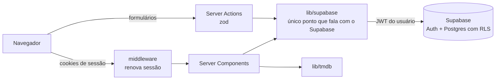

# EmCartaz — Contas de usuário com Supabase (Design)

- **Data:** 2026-09-30
- **Status:** em revisão
- **Spec anterior:** [2026-09-29-catalogo-streaming-design.md](2026-09-29-catalogo-streaming-design.md)

## 1. Objetivo e contexto

O MVP não tem banco de dados. Esta etapa adiciona **contas de usuário** e dois recursos por usuário, usando o Supabase (Postgres + Auth) integrado ao Next.js existente, sem um servidor separado.

### Critérios de sucesso

1. Cadastro, login, logout e recuperação de senha funcionando em produção.
2. **Minha lista** e **Minhas plataformas** funcionando em produção.
3. Isolamento entre usuários garantido pelo banco (RLS) e provado por testes SQL.
4. Nenhuma chave privilegiada (`service_role`) no app; só a chave pública + JWT do usuário.
5. Visitante deslogado tem exatamente a experiência atual; links compartilhados continuam reproduzíveis.
6. CI verde: lint, format, unit/integração, build, typecheck, testes de banco e E2E contra um Supabase local.
7. README atualizado (arquitetura e decisões).

## 2. Decisões de escopo

| Decisão | Escolha |
|---|---|
| Backend | Supabase (Postgres + Auth), acessado pelo Next via `@supabase/ssr` |
| Login | E-mail + senha (mínimo de 8 caracteres) |
| Confirmação de e-mail | Desligada; o cadastro já entra. Recuperação de senha por e-mail incluída |
| Acesso a dados | Só no servidor (Server Components e Server Actions), com RLS no banco |
| Ambiente local | Supabase CLI + Docker (`supabase start`) |

**Fora do escopo (v1):** OAuth, confirmação de e-mail, SMTP próprio, trocar e-mail, excluir conta pela UI, "assistidos"/notas, botão de salvar nos cards da grade, recursos sociais.

## 3. Funcionalidades

1. **Autenticação:** criar conta, entrar, sair, recuperar senha.
2. **Minha lista:** salvar e remover filmes pela página do filme; página `/minha-lista`.
3. **Minhas plataformas:** salvar os serviços assinados; o catálogo abre já filtrado por eles.

## 4. Arquitetura



- **`lib/supabase/` é a única fronteira com o Supabase**, no mesmo espírito do `lib/tmdb`: é `server-only`, devolve tipos de domínio, e a UI nunca monta query.
  - `server.ts`: `createServerClient` com cookies de `next/headers`.
  - `auth.ts`: `getCurrentUser(): Promise<{ id: string; email: string } | null>` usando `auth.getUser()`, que valida o JWT no servidor (nunca `getSession()` para decisões de acesso). Também traz os wrappers de signUp, signIn, signOut, reset e updatePassword.
  - `watchlist.ts`: `getWatchlistIds`, `addToWatchlist`, `removeFromWatchlist`.
  - `user-providers.ts`: `getSavedProviders`, `saveProviders`.
  - `errors.ts`: mapa de erros do Supabase para mensagens em PT-BR (credenciais inválidas, e-mail já cadastrado, senha fraca, rate limit, fallback genérico).
  - `database.types.ts`: gerado por `supabase gen types typescript --local`.
- **`src/middleware.ts`** renova a sessão a cada request. O matcher exclui `_next/static`, `_next/image`, imagens e favicon.
- **Variáveis de ambiente novas:** `NEXT_PUBLIC_SUPABASE_URL` e `NEXT_PUBLIC_SUPABASE_PUBLISHABLE_KEY`. As duas são públicas por design; a proteção é o RLS.

## 5. Modelo de dados

Migrations versionadas em `supabase/migrations/`.

```sql
create table public.watchlist (
  user_id    uuid not null references auth.users on delete cascade,
  tmdb_id    integer not null check (tmdb_id > 0),
  created_at timestamptz not null default now(),
  primary key (user_id, tmdb_id)
);

create table public.user_providers (
  user_id      uuid primary key references auth.users on delete cascade,
  provider_ids integer[] not null default '{}'
                 check (cardinality(provider_ids) <= 20),
  updated_at   timestamptz not null default now()
);
```

- **RLS ligado nas duas tabelas**, com policies só para a role `authenticated` e `user_id = (select auth.uid())`. A `watchlist` tem `select`, `insert` e `delete` (linhas são imutáveis, sem `update`). A `user_providers` tem `select`, `insert` e `update` (o app nunca apaga; o `on delete cascade` cuida da exclusão da conta). A role `anon` não tem nenhum privilégio nas tabelas.
- **Limite de 100 filmes por usuário** na `watchlist`, garantido por um trigger `before insert` que levanta uma exceção com código próprio. Ele também é verificado na Server Action para dar uma mensagem amigável.
- Salvar um filme repetido é um no-op (`on conflict do nothing`).
- A `watchlist` guarda só o `tmdb_id`; os detalhes vêm do TMDB (cache de 24h). Não há dados duplicados ficando desatualizados.
- `user_providers` usa um array porque é sempre lido e gravado inteiro. O limite de 20 espelha o `MAX_IDS_PER_FILTER`.
- Não há tabela `profiles` (nada da v1 precisa dela).

## 6. Autenticação: páginas e fluxos

Todos os formulários usam Server Actions com zod e funcionam sem JavaScript.

| Rota | Comportamento |
|---|---|
| `/entrar` | Abas "Entrar" e "Criar conta". Criar conta faz `signUp` e já entra; Entrar faz `signInWithPassword`. Aceita `?voltar=` |
| `/recuperar-senha` | Pede o e-mail e chama `resetPasswordForEmail`. A mensagem é sempre a mesma, para não revelar quais e-mails existem |
| `/auth/confirmar` | Route handler: lê `token_hash` e `type=recovery`, chama `verifyOtp` e redireciona para `/nova-senha`. Com link inválido ou expirado, volta para `/recuperar-senha` com um aviso |
| `/nova-senha` | Exige sessão e chama `updateUser({ password })` |
| Sair | Server Action: `signOut` e redirect para `/` |

- **`voltar`** só aceita caminhos internos: começa com `/`, não com `//`, e não tem esquema. Qualquer outro valor vira `/`. A validação fica numa função pura (`safeRedirectPath`).
- Usuário já logado que acessa `/entrar` é redirecionado para `voltar` ou `/`.
- **Header:** deslogado, mostra "Entrar"; logado, um menu com o e-mail, "Minha lista", "Minhas plataformas" e "Sair".

## 7. Minha lista

- **Botão "Salvar na lista" / "Na minha lista"** no `movie-hero` da página do filme. É um client component com `useOptimistic`: alterna na hora e reverte com uma mensagem se a Server Action falhar. Deslogado, é um link para `/entrar?voltar=/filme/<id>`.
- **Server Action `toggleWatchlist(tmdbId, saved)`:** valida o ID com zod, exige usuário e respeita o limite de 100.
- **`/minha-lista`:** é protegida (deslogado vai para `/entrar?voltar=/minha-lista`).
  - Lê os IDs (mais recentes primeiro) e busca `getMovieDetails` em paralelo.
  - Reusa o `MovieGrid`.
  - Filme sem nenhuma plataforma de assinatura no BR aparece com o selo "fora do streaming".
  - Filme que retorna 404 no TMDB é omitido.
  - Lista vazia mostra o `EmptyState` com um link para o catálogo.

## 8. Minhas plataformas

- **`/minhas-plataformas`:** é protegida e mostra checkboxes com as plataformas da allowlist (as mesmas da barra de filtros), já marcadas com as salvas.
  - A Server Action `saveProviders` valida com zod e aceita só IDs da allowlist.
  - Depois de salvar, redireciona para `/`.
- **Aplicação automática no catálogo** (`app/(catalogo)/page.tsx`), via a função pura `resolveProviderRedirect(searchParams, saved): string | null`:
  - Se não há `q` nem `p` na URL, o usuário está logado e tem plataformas salvas, faz `redirect` para a mesma URL com `p=<salvas>`, preservando `g`, `ano` e `ordem`.
  - `p=todas` significa "todas as plataformas, não aplique as minhas". O `parseFilters` já descarta valores inválidos, então isso resulta em `providers: []`.
  - Usuário deslogado, sem plataformas salvas ou buscando: nenhum redirect.
- **Barra de filtros:** recebe `savedProviders` (vazio para quem está deslogado).
  - Quando um usuário com plataformas salvas desmarca todas, a navegação escreve `p=todas` em vez de remover o parâmetro.
  - Um chip "Minhas plataformas" reaplica as salvas. Ele só aparece para quem tem plataformas salvas.
- A Server Action `loadMore` (rolagem infinita) não muda: ela recebe a query string, que já tem o `p` resolvido.

## 9. Tratamento de erros

- Erros de auth são mostrados no formulário, em PT-BR, via `errors.ts`.
- Falha do Supabase em leituras (`/minha-lista`, plataformas salvas no catálogo):
  - no catálogo, segue sem aplicar plataformas (degrada para a experiência deslogada);
  - em `/minha-lista`, cai no `error.tsx` existente.
- Falha em escritas: a Server Action devolve `{ ok: false, message }` e o client reverte o estado otimista.
- As Server Actions nunca confiam no `user_id` vindo do client: o usuário sempre vem de `getCurrentUser()`, e o RLS é a segunda barreira.

## 10. Testes

- **Unitários e integração (Vitest):**
  - `lib/supabase/*` é mockado com `vi.mock` na fronteira.
  - Os testes cobrem as Server Actions (validação, limite, allowlist, usuário ausente), `safeRedirectPath` (incluindo `//evil.com` e `https://…`), `resolveProviderRedirect` (`p` ausente, `p=todas`, `q`, sem salvas, deslogado), o mapa de erros e os componentes (botão otimista com rollback, formulários, chip).
- **Banco (pgTAP, `supabase test db`):** o usuário A não lê, insere, altera nem apaga dados do B; `anon` não vê nada; o trigger do limite de 100 dispara; o check de 20 plataformas dispara.
- **E2E (Playwright):** roda contra o Supabase local (`supabase start`) e o mock atual do TMDB. Os fluxos são:
  - criar conta, salvar um filme, vê-lo em `/minha-lista` e removê-lo;
  - salvar plataformas, ver `/` redirecionar para `?p=…`, desmarcar todas e ver `p=todas`;
  - sair e ver o catálogo sem redirect;
  - recuperar senha com o link lido da API do Mailpit, definir uma nova senha e entrar com ela.
- **CI:** novo job `db` (`supabase start` + `supabase test db`). O job `e2e` passa a subir o Supabase e exporta as variáveis `NEXT_PUBLIC_SUPABASE_*` locais (via `supabase status -o env`).

## 11. Configuração e deploy

**Local:** Docker Engine + Supabase CLI. O `supabase/config.toml` versionado desliga a confirmação de e-mail e define `site_url` e `additional_redirect_urls` para localhost. `.env.example` ganha as duas variáveis.

**Checklist de produção (manual, no painel do Supabase e na Vercel):**
1. `supabase link --project-ref <ref>` e `supabase db push`.
2. Authentication → Providers → Email: desligar "Confirm email".
3. Authentication → URL Configuration: Site URL = domínio da Vercel; Redirect URLs com a Vercel e `http://localhost:3000/**`.
4. Template "Reset password": o link aponta para `{{ .RedirectTo }}?token_hash={{ .TokenHash }}&type=recovery`. O app envia `redirectTo = <origem>/auth/confirmar`, e o Supabase só aceita origens listadas em Redirect URLs. O mesmo template vale para localhost, E2E e produção.
5. Authentication → Providers → Email: senha mínima de 8 caracteres.
6. Vercel: definir `NEXT_PUBLIC_SUPABASE_URL` e `NEXT_PUBLIC_SUPABASE_PUBLISHABLE_KEY`.

**README:** atualizar o diagrama de arquitetura e substituir a linha "Sem banco de dados" na tabela de decisões, explicando a mudança (contas de usuário pedem estado persistente; o catálogo continua vindo do TMDB sem índice próprio).
